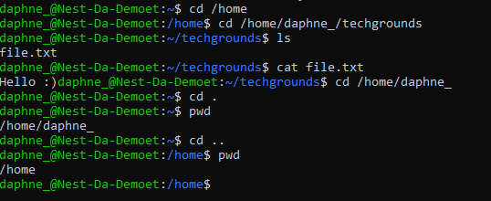

# [Files and directories]
Finding out the current working directory, make a listing of all files in the directory, making a new directory named 'techgrounds', creating a text file with content and navigating through the tree using both absolute and relative paths.

## Key terminology
- Absolute path: An absolute path refers to the complete details needed to locate a file or folder, starting from the root element and ending with the other subdirectories.
- Relative path: A relative path refers to a location that is relative to a current directory. Relative paths make use of two special symbols, a dot (.) and a double-dot (..), which translate into the current directory and the parent directory.
- Directory: A directory is a location for storing files on your computer.

## Exercise
### Sources
- https://linuxhint.com/absolute-relative-paths-linux/
- https://www.hostinger.com/tutorials/linux-commands
- https://www.pcwdld.com/linux-commands-cheat-sheet

### Overcome challenges
I was a little confused by the use of words on the assignment. I thought there needed to be directories already present, but I asked Shikha everything looked fine to her so I could continue the assignment.

### Results
Made a SSH-connection, navigated by using both absolute and relative paths. Made a new dir and added a .txt file containing text to it. 

