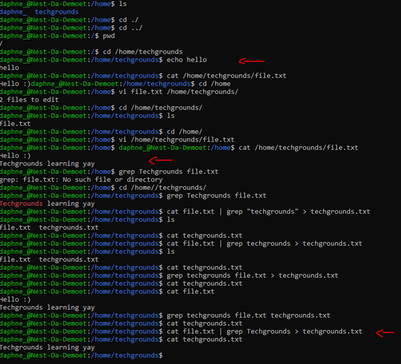

# [Working with text]
Using the echo command and outpus rediraction to add a new sentence containing 'techgrounds'. Using a command to print the contents of the file to the terminal. Using a command so it only prints the sentance containing 'techgrounds'. Redirection the filtered output to a new file called 'techgrounds.txt'.

## Key terminology
- Terminal: 
- Echo command: 
- Input: 
- Output: 
- Pipe command: 

## Exercise
### Sources
- https://www.a2hosting.com/kb/getting-started-guide/working-with-linux/editing-text-files
- https://phoenixnap.com/kb/echo-command-linux
- https://www.cyberciti.biz/faq/howto-search-find-file-for-text-string/#:~:text=You%20need%20to%20use%20the,match%20or%20a%20text%20string.
- https://www.cyberciti.biz/faq/howto-use-grep-command-in-linux-unix/
- https://opensource.com/article/18/8/introduction-pipes-linux

### Overcome challenges
I couldn't figure out what command to use to filter words and printing it to the terminal, my teammate already finsihed this assignment so I asked her for help, she told me to look for the grab command and I quickly found the sollution. When I used the line `cat file.txt | grep techgrounds > techgrounds.txt` it didn't work and I couldn't figure out why. So I tried to explain to myself what I wanted to do and achieve. Shortly after, I found out I needed to be carefule of upper- and lowercase. The word 'Techgrounds' in the file.txt was with an uppercase but I typed the command to find it with a lowercase. 

### Results
A screenshot containing me using the echo command, filtering output of the text file and redirection the filtered output to a new text file.

