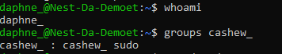
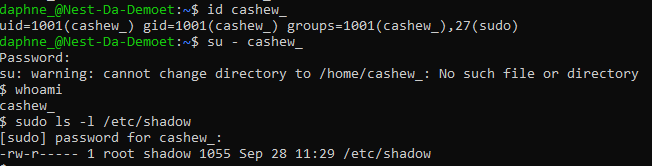
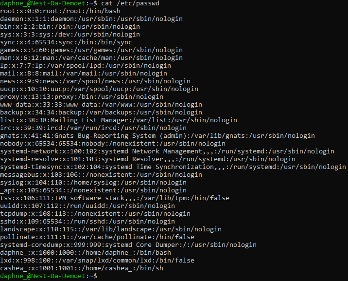

# [Users and groups]
Create a new user that: is part of an admin group, has a password and can use sudo. Locating the new user's data.

## Key terminology
- Root: Root is the superuser account in Unix and Linux. It is a user account for administrative purposes, and typically has the highest access rights on the system.
- Sudo: Is an acronym for superuser do or substitute user do, is a command that runs an elevated prompt without a need to change your identity. Depending on your settings in the /etc/sudoers file, you can issue single commands as root or as another user.

## Exercise
### Sources
- https://linuxize.com/post/how-to-create-users-in-linux-using-the-useradd-command/
- https://www.baeldung.com/linux/sudo-privileges-user
- https://linuxize.com/post/how-to-list-groups-in-linux/#:~:text=doesn't%20exist.-,List%20All%20Groups,represents%20information%20for%20one%20group.&text=Another%20option%20is%20to%20use,configured%20in%20%2Fetc%2Fnsswitch.
- https://www.cyberciti.biz/faq/where-are-the-passwords-of-the-users-located-in-linux/
- https://www.cyberciti.biz/faq/add-new-user-account-with-admin-access-on-linux/#:~:text=Open%20the%20terminal%20application,run%3A%20usermod%20%2DaG%20sudo%20marlena

### Overcome challenges
I wasn't sure how to check if the new user had sudo privelage because I was looking at the user's data. I found an article that told me the best way to check is to login as the new user and try to execute a sudo command.

### Results
Created a new user `cashew_` gave them sudo privileges and a password. They are also part of an admin group called `sudo`, located `cashew_`'s data and made screenshots of my results.

