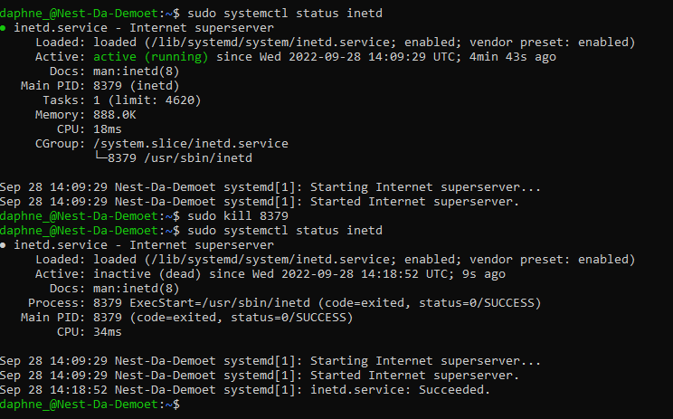

# [Processes]
Starting a telnet daemon on my linux machine. Find out the PID and memory usage of the telnet daemon. Kill the telnet process.

## Key terminology
- Daemons: A daemon runs in the background and is non-interactive.
- Services: A Service responds to requests from programs. A service may be interactive.
- Programs: A program is run and used by users.
- VIM: Vim is a Unix text editor that's included in Linux, BSD, and macOS.
- $PATH: This is a variable that can be configured to tell our Linux system where to look for certain programs. That way, when typing a command into the terminal, Linux checks the $PATH variable to see a list of directories to look for the program.
- PID: A PID is an acronym for process identification number on a Linux or Unix-like operating system. A PID is automatically assigned to each process when it is created.

## Exercise
### Sources
- https://linuxhint.com/linux-telnet-command/
- https://www.cyberciti.biz/faq/how-do-i-turn-on-telnet-service-on-for-a-linuxfreebsd-system/
- https://forum.lowyat.net/topic/346775

### Overcome challenges
I was stuck because the first few guides I came across wanted me to get Telnet client through Windows features but my pc didn't allow that. I looked at sources of other people and figured it out by looking at other guides.

### Results
Installed and started telnet daemon. Found the PID`8379` and memory usage`888.0K`. Finally killed the telnet process.

