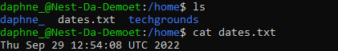
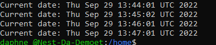
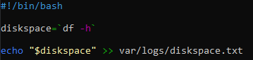
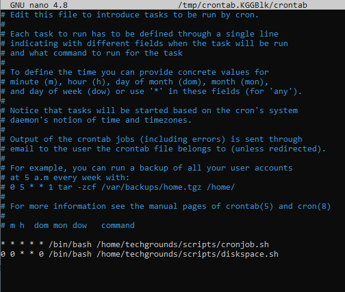

# [Cron jobs]
Making automated bash scripts using Cron jobs to write data to a text file and terminal on a regular schedule.

## Key terminology
- Cron jobs: Cron jobs are a standard method of scheduling tasks to run on your server. Cron is a service running in the background that will execute commands (jobs) at a specified time, or at a regular interval.
- Crontab: Crontab is a UNIX command that creates a table or list of commands, each of which is to be executed by the operating system at a specified time.

## Exercise
### Sources
- https://stackoverflow.com/questions/8395358/creating-a-file-in-a-specific-directory-using-bash
- https://www.howtogeek.com/409611/how-to-view-free-disk-space-and-disk-usage-from-the-linux-terminal/#:~:text=Bash%20contains%20two%20useful%20commands,terminal%20window%20to%20get%20started
- https://www.cyberciti.biz/faq/unix-linux-getting-current-date-in-bash-ksh-shell-script/
- https://www.cyberciti.biz/faq/how-do-i-add-jobs-to-cron-under-linux-or-unix-oses/
- https://www.cyberciti.biz/faq/how-to-run-cron-job-every-minute-on-linuxunix/
- https://kb.iu.edu/d/abdb#:~:text=To%20change%20file%20and%20directory,%2C%20write%2C%20and%20execute%20permissions.
- https://linuxhint.com/run_cron_job_every_minute/

### Overcome challenges
My cron job didn't work so I gave permissions to the script and text file with `sudo chmod u+rwx FILENAME`, but it still didn't work. Turns out I needed to use `a+rwx` instead of `u+rwx`, that way it did work.

### Results

Created a Bash script that writes the current date and time to a file in the home directory.

Registered the script in the crontab so that it runs every minute.

Create a script that writes available disk space to a log file in ‘/var/logs’. Used the cron job so that it runs weekly.

