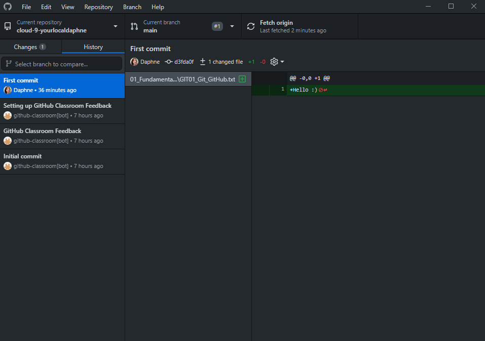

# [Git and Github]
[Creating an account on GitHub and making a repository. Giving permission to teammates to collaborate. Using git to push and pull/clone.]

Simply put, Git is a version control system that lets you manage and keep track of your source code history. GitHub is a cloud-based hosting service that lets you manage Git repositories. If you have open-source projects that use Git, then GitHub is designed to help you better manage them. 

## Key terminology
- Repository: A repository contains all of your project's files and each file's revision history.
- Main / Master: The default branch name of the repository.
- Branch: Branches isolate development work without affecting other branches in the repository.
- Commit: A commit records changes to one or more files in your branch.
- Push: The git push command is used to upload local repository content to a remote repository.
- Pull: Pull requests let you tell others about changes you've pushed to a branch in a repository on GitHub.
- Merge: Merging is Git's way of putting a forked history back together again.
- Fork: A fork is a copy of a repository that you manage. Forks let you make changes to a project without affecting the original repository.
 
## Exercise
### Sources
- https://www.youtube.com/watch?v=8Dd7KRpKeaE
- https://www.youtube.com/watch?v=wrb7Gge9yoE
- https://youtu.be/z8CYDyFqzp0
- https://youtu.be/F9DveOGPd4E

### Overcome challenges
[A big part of the exercise wasn't clear for me; I wasn't sure if the repository of exercise one was the same as exercise two and to who I needed to give permission exactly. So I asked a lot of questions during the Q&A and got answers to them.]

### Results
[Created a new repository, gave my teammates permission to collaborate and cloned their repository.]

