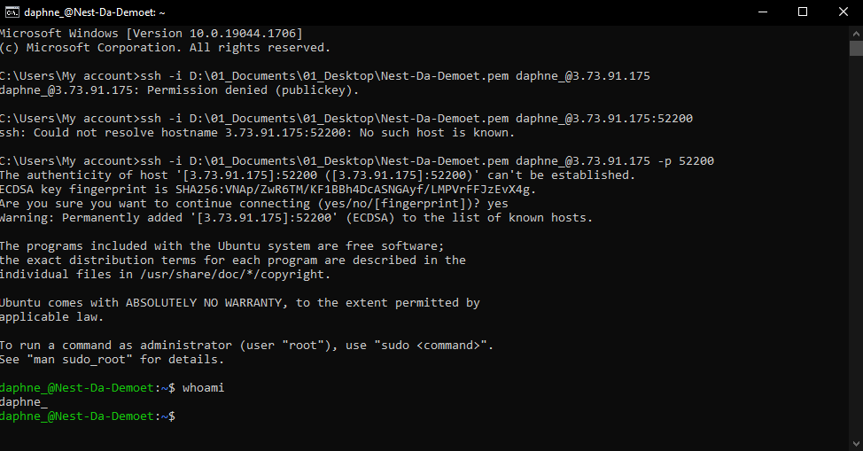

# [Setting up]
Making a SSH-connection to a VM and typing "whoami" when connected.

## Key terminology
- GUI: Graphical User Interface, is a form of user interface that allows users to interact with electronic devices through graphical icons and audio indicator such as primary notation, instead of text-based UIs, typed command labels or text navigation.
- CLI: A command-line interface (CLI) is a text-based user interface (UI) used to run programs, manage computer files and interact with the computer.
- VM: Virtual Machine (VM) is a compute resource that uses software instead of a physical computer to run programs and deploy apps.
- SSH: or Secure Shell is a tool for secure system administration, file transfers, and other communication across the Internet or other untrusted network. It encrypts identities, passwords, and transmitted data so that they cannot be eavesdropped and stolen.

## Exercise
### Sources
- https://www.youtube.com/watch?v=KLN2bY0dTtQ
- https://www.youtube.com/watch?v=JbMgOKlj5fE
- https://www.geeksforgeeks.org/ssh-command-in-linux-with-examples/
- https://www.techrepublic.com/article/how-to-ssh-into-an-aws-instance/
- https://www.howtogeek.com/670447/how-to-copy-the-full-path-of-a-file-on-windows-10/
- https://superuser.com/questions/1296024/windows-ssh-permissions-for-private-key-are-too-open

 
### Overcome challenges
The key I wanted to use was 'too open', but I found a very good article that had the same problem. I was so focussed on making it work that I forgot I probably needed to change permissions. Luckily when I read the assignment again I knew what to look for. 

### Results
Made a connection with the VM using the information that was given to me through the mail. Used the command whoami and made a screenshot.

