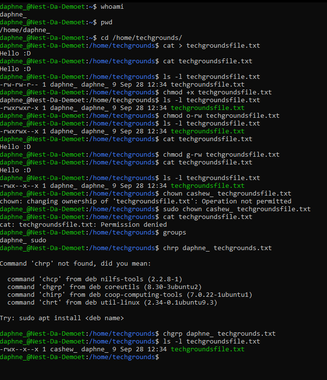

# [File permissions]
Create a text file, list the file's permissions, make it executable, removing the read and write permissions except for the owner. Change the ownership of the file to a different user. Change the group ownership of the file to a different group.

## Key terminology
- File permissions: In Linux, file permissions, attributes, and ownership control the access level that the system processes and users have to files.
- Execute: The Execute permission affects a user's capability to execute a file or view the contents of a directory.
- Read: The Read permission refers to a user's capability to read the contents of the file.
- Write: The Write permissions refer to a user's capability to write or modify a file or directory

## Exercise
### Sources
- https://www.cyberciti.biz/faq/create-a-file-in-linux-using-the-bash-shell-terminal/
- https://www.pluralsight.com/blog/it-ops/linux-file-permissions
- https://www.washington.edu/doit/technology-tips-chmod-overview
- https://docs.oracle.com/cd/E19683-01/816-4883/6mb2joat0/index.html
- https://docs.oracle.com/cd/E19683-01/816-4883/6mb2joat3/index.html
- https://www.linuxfoundation.org/blog/blog/classic-sysadmin-understanding-linux-file-permissions#:~:text=read%20%E2%80%93%20The%20Read%20permission%20refers,the%20contents%20of%20a%20directory.

### Overcome challenges
I didn't knew what kind of `chmod` commands I had to add/remove from the file but I found multiple articals explaining everything you can do with `chmod`.

### Results
Created a new text file called `techgroundsfile.txt` listed the file's permission, made it executable, removed `rw` permission expect for the owner `daphne_`. Changed the ownership to `cashew_`. Changed the group ownership an othergroup called `daphne_`.

