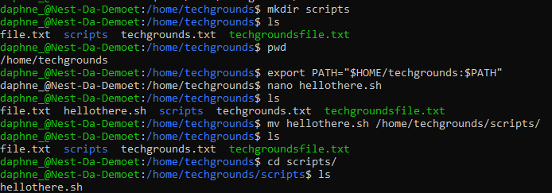
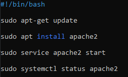
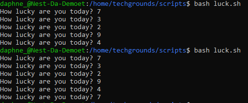

# [Bash scripting]
Making and running scripts with bash. Making PATH variable. Generating random numbers and checking conditions using `if`, `elif` and/or `else`.

Simply put, bash is a shell and command language that is used in Linux. 

## Key terminology
- Bash shell: Bash is the shell, or command language interpreter, for the GNU operating system.
- Bash script: A bash script is a series of commands written in a file. These are read and executed by the bash program. The program executes line by line.
- PATH variable: The PATH variable is an environment variable containing an ordered list of paths that Linux will search for executables when running a command.
- httpd: Apache HTTPD is an HTTP server daemon produced by the Apache Foundation. It is a piece of software that listens for network requests (which are expressed using the Hypertext Transfer Protocol) and responds to them.
- if: The if condition is considered the simplest of the three and makes a decision based on whether the condition is true or not. If the condition is true, it prints out the indented expression. If the condition is false, it skips printing the indented expression.
- elif: The elif is short for else if. It allows us to check for multiple expressions. If the condition for if is False , it checks the condition of the next elif block and so on. If all the conditions are False , the body of else is executed.
- else: In programming languages, an else statement is an alternative statement that is executed if the result of a previous test condition evaluates to false.

## Exercise
### Sources
- https://www.youtube.com/watch?v=SPwyp2NG-bE
- https://linuxhint.com/generate-random-number-bash/#:~:text=The%20random%20number%20or%20a,RANDOM%20with%20a%20specific%20value
- https://www.youtube.com/watch?v=Ec9WQGw4lW0
- https://linuxize.com/post/how-to-add-directory-to-path-in-linux/
- https://stackoverflow.com/questions/1194882/how-to-generate-random-number-in-bash
- https://linuxhint.com/bash_if_else_examples/

### Overcome challenges
While working on exercise 3 for some reason my script didn't work, I tried changing things around but nothing seemed to work. I decided to rewrite the script entirely from scratch and after that it worked fine.

### Results
- Exercise 1:
Created a directory called 'scripts'. Added the scripts directory to the PATH variable.

Created a script that appends a line of text to a text file whenever it is executed.

Created a script that installs the httpd package, activates httpd, and enables httpd. The status of the https is shown on the terminal.

- Exercise 2:
Created a script that generates a random number between 1 and 10, stores it in a variable, and then appends the number to a text file.

- Exercise 3:
Created a script that generates a random number between 1 and 10, stores it in a variable, and then appends the number to a text file only if the number is bigger than 5. If the number is 5 or smaller, it should append a line of text to that same text file instead.

