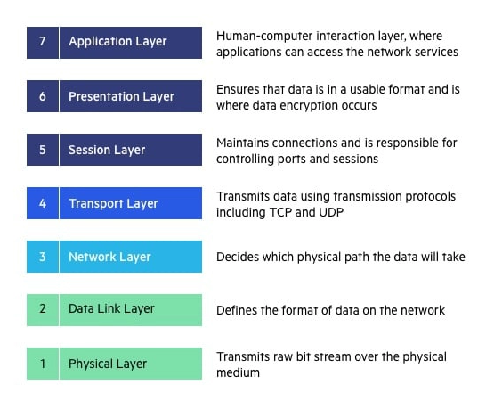
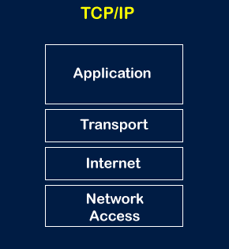

# [OSI Stack]
Study OSI- and TCP/IP model and its uses.

The Open Systems Interconnection (OSI) model describes seven layers that computer systems use to communicate over a network. It was the first standard model for network communications, adopted by all major computer and telecommunication companies in the early 1980s

## Key terminology
- Telecommunication: Telecommunication is the transmission of information by various types of technologies over wire, radio, optical, or other electromagnetic systems.
- Troubleshooting: Troubleshooting is a systematic approach to problem-solving that is often used to find and correct issues with complex machines, electronics, computers and software systems.
- Bottom-up approach: This approach begins with the physical layer of the OSI model and works its way up. New, higher bandwidth links might be purchased, as well as new routers, switches, firewalls, etc. Designing a network with a bottom-up approach enables you to get your network set up much faster.
- Top-down approach: With this approach, we are going to start with the requirements of the organization, the technology that is needed, and then design it from the top-down. The application layer is the starting point, and the applications and services that are desperately needed are analyzed for their specific requirements first.  

## Exercise
### Sources
- https://www.imperva.com/learn/application-security/osi-model/
- https://www.youtube.com/watch?v=LANW3m7UgWs
- https://www.youtube.com/watch?v=CRdL1PcherM
- https://www.cbtnuggets.com/blog/technology/networking/top-down-vs-bottom-up-network-design
- https://www.tutorialspoint.com/OSI-vs-TCP-IP-Reference-Model

### Overcome challenges
I didn't knew what osi and tcp/ip was so I had to look for an explanation.

### Results
The OSI model and TCP/IP model are a networking models that describes how information in transferred from one networking component to another. In the early days of computer networking, vendors created networking models that would only support their own product. 

This was not good for both manufacturers and consumers, manufacturers were forced to make all essential networking devices and forced consumers to buy all devices from the same manufacturer. To break this barrier manufacturers agreed to use a vendor neutral networking model. Two models were created: the OSI model and TCP/IP model. 

The OSI model consists of 7 layers.

While the TCP/IP model consists of 4 layers.

They both share the same 4 layers but the OSI model added 'Data link', 'Session' and ' Presentation.

The key difference between the OSI and TCP/IP model are:
- The OSI model helps you to standardize router, switch, motherboard, and other hardware, whereas TCP/IP helps you to establish a connection between different types of computers
- The OSI model is based on a vertical approach and the TCP/IP model is based on a horizontal approach.
- The TCP/IP model is highly used, whereas the OSI model usage is very low.

In conclusion:
OSI model and TCP/IP model are a networking models that describes how information in transferred from one networking component to another. If someone is focusing on the proper documentation, specification, and modularization, they should prefer the OSI model over the TCP/IP model. But if someone is focusing more on the implementation, reliability, and security of the network, they should prefer the TCP/IP model over the OSI model.