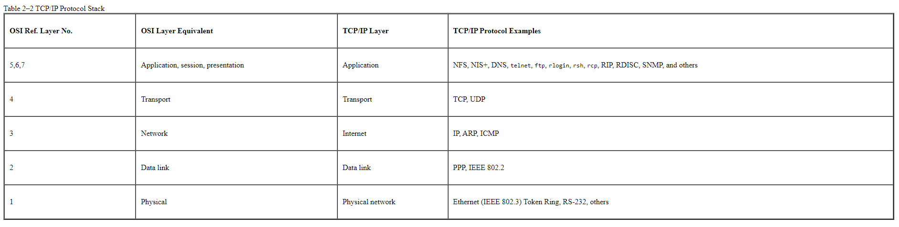
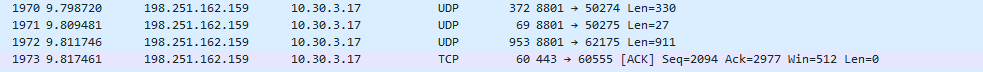

# [Protocols]
In networking, a protocol is a set of rules for formatting and processing data. They are like a common language for computers. The computers within a network may use different software and hardware. However, the use of protocols enables them to communicate with each other regardless of that.

## Key terminology
- Network protocol: A network protocol is an established set of rules that determine how data is transmitted between different devices in the same network. Essentially, it allows connected devices to communicate with each other, regardless of any differences in their internal processes, structure or design.
- TCP: TCP stands for Transmission Control Protocol a communications standard that enables application programs and computing devices to exchange messages over a network. It is designed to send packets across the internet and ensure the successful delivery of data and messages over networks.
- UDP: The User Datagram Protocol, or UDP, is a communication protocol used across the Internet for especially time-sensitive transmissions such as video playback or DNS lookups. It speeds up communications by not formally establishing a connection before data is transferred. This allows data to be transferred very quickly, but it can also cause packets to become lost in transit — and create opportunities for exploitation in the form of DDoS attacks.
- Fire and forget strategy: The meaning of "fire and forget" is that the driver will not confirm the write with the server. Your write is placed on the network, the driver confirms it reaches the network transport but past that no other checking is performed.
- Three-way handshake: TCP uses a three-way handshake to establish a reliable connection. The connection is full duplex, and both sides synchronize (SYN) and acknowledge (ACK) each other. The exchange of these four flags is performed in three steps SYN, SYN-ACK, and ACK
- HTTPS: Stands for Hypertext Transfer Protocol Secure. It is the protocol where encrypted HTTP data is transferred over a secure connection. By using secure connection such as Transport Layer Security or Secure Sockets Layer, the privacy and integrity of data are maintained and authentication of websites is also validated.
- SSH: The Secure Shell Protocol (SSH) is a cryptographic network protocol for operating network services securely over an unsecured network.

## Exercise
### Sources
- https://www.comptia.org/content/guides/what-is-a-network-protocol#:~:text=A%20network%20protocol%20is%20an,internal%20processes%2C%20structure%20or%20design.
- https://docs.oracle.com/cd/E19683-01/806-4075/ipov-10/index.html
- https://www.quora.com/How-would-one-create-and-implement-their-own-networking-protocol
- https://www.tek-tools.com/network/how-to-use-wireshark

### Overcome challenges

### Results

### Identify several other protocols and their associated OSI layer. Name at least one for each layer.
A table with several protocols and their OSI layer

### Figure out who determines what protocols we use and what is needed to introduce your own protocol. 
Organizations that determin protcols:
- W3C
- ITU-T
- IAB
- ISOC
- IETF
- IRTF
- IEEE
- ICANN

If you want to introduce a new protocol you have to write a specification that defines the data you send through the TCP sockets. Mostly you are defining commands and payloads. Then I needs to be accepted by an IETF group.

### Look into wireshark and install this program. Try and capture a bit of your own network data. Search for a protocol you know and try to understand how it functions.
Here you can see UDP and TCP protocols being used on my own network:

UDP is a standerdized method for transferring data between two computers in a network. UDP does this process in a simple fashion: it sends packets (units of data transmission) directly to a computer without making a connection first, indicating the order of the packets or checking if they arrived as intended. It is much faster than TCP but less reliable because of that.  
