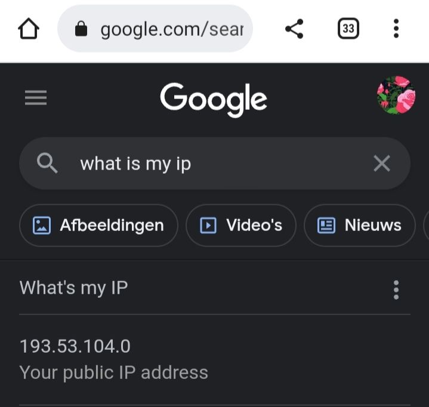

# [Counting in Binary and Hex]
An IP address is a long string of numbers assigned to every device connected to a network that uses Internet Protocol as the medium for communication.

## Key terminology
- IPv4: Internet Protocol version 4 is the fourth version of the Internet Protocol (IP). It is one of the core protocols of standards-based internetworking methods in the Internet and other packet-switched networks.
- IPv6: IPv6 is the next generation Internet Protocol (IP) address standard intended to supplement and eventually replace IPv4, the protocol many Internet services still use today.
- NAT: Stands for network address translation. It’s a way to map multiple local private addresses to a public one before transferring the information.
- Public IPs: is an IP address that can be accessed directly over the internet and is assigned to your network router by your internet service provider.
- Private IPs: In Internet networking, a private network is a computer network that uses a private address space of IP addresses. These addresses are commonly used for local area networks (LANs) in residential, office, and enterprise environments.
- Static address: When a device is assigned a static IP address, the address does not change.
- Dynamic address: A dynamic IP address is an IP address that an ISP lets you use temporarily.

## Exercise
### Sources
- https://www.makeuseof.com/tag/find-ip-address-mobile-smartphone/
- https://www.digitalcitizen.life/find-public-ip-address/
- https://www.geeksforgeeks.org/can-two-ip-addresses-be-same/#:~:text=All%20public%20IPs%20assigned%20to,IP%20identifies%20your%20device%20uniquely.
- https://www.makeuseof.com/tag/find-ip-address-mobile-smartphone/

### Overcome challenges
I couldn't check what devices where connected because of the same issue in NTW02_network_devices.

### Results

### Find out what your public wifi IP address is of your pc and phone.
My phone:

My pc:

### Why are they the same?
Because all of my devices are connected to the same public route.

### Find out what your private wifi IP address is of your pc and phone.
My pc:

My phone:

### What happens when you change your private IP of your phone to the one of your pc?
It connects with the internet.

### What happens when you try to change the private IP of your phone to an IP adress outside of your network?

It doesn't connect with the internet.