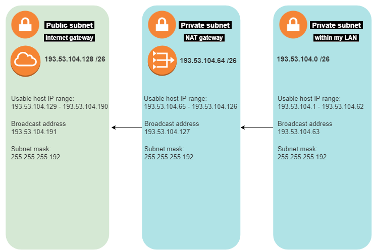

# [ Subnetting ]
Making a network architecture visual with: 1 private subnet within LAN with a minimum of 15 hosts. 1 private subnet with internet acces through NAT gateway with a minimum of 30 hosts. 1 public subnet with an internet gateway with a minimum of 5 hosts.

A subnet is a network inside a network, subnets are there to make netowkrs more effiecent. Through subnetting, network traffic doens't have to travel through unnecessary routers so make the travel distance much shorter.

## Key terminology
- Subnet: A subnet, or subnetwork, is a segmented piece of a larger network. More specifically, subnets are a logical partition of an IP network into multiple, smaller network segments.
- LAN: A LAN is a group of personal computers and associated equipment that are linked by cable, for example in an office building, and that share a communications line.
- Subnet mask: A subnet mask is a 32-bit number created by setting host bits to all 0s and setting network bits to all 1s. In this way, the subnet mask separates the IP address into the network and host addresses. The “255” address is always assigned to a broadcast address, and the “0” address is always assigned to a network address.
- CIDR: CIDR notation (Classless Inter-Domain Routing) is an alternate method of representing a subnet mask. It is simply a count of the number of network bits (bits that are set to 1) in the subnet mask.
- Network architecture: Network architecture is the design of a computer network. It is a framework for the specification of a network's physical components and their functional organization and configuration, its operational principles and procedures, as well as communication protocols used.
- NAT: stands for network address translation. It's a way to map multiple local private addresses to a public one before transferring the information.

## Exercise
### Sources
- https://www.controltechnology.com/Files/common-documents/application_notes/Understanding-CIDR-Notation-for-IP-Address-Display#:~:text=CIDR%20notation%20(Classless%20Inter%2DDomain,1)%20in%20the%20subnet%20mask.
- https://www.uturndata.com/2021/02/23/aws-quick-tips-internet-gateways-nat-gateways-and-nat-instances/
- https://www.calculator.net/ip-subnet-calculator.html
- https://docs.axway.com/bundle/SecureTransport_54_on_AWS_InstallationGuide_allOS_en_HTML5/page/Content/AWS/securitygroups/st_nat_gateway_subnet_routing.htm#:~:text=Navigate%20to%20Virtual%20Private%20Cloud,Click%20Create%20a%20NAT%20Gateway
- https://docs.cherryservers.com/knowledge/public-ip-subnet

### Overcome challenges
I wasn't sure what information exactly I needed put in the visual, so I looked at what my teammates had.

### Results

3 Subnets with the right ammount of hosts available as needed in the assignment. The private subnet via LAN has enough for a minimum of 15 hosts, the private subnet through NAT gateway has enough for a minimum of 30, and the public subnet with internet gateway has enough for a minimum of 5 hosts. All nessesary data is displayed in the visual.

