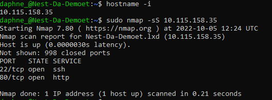
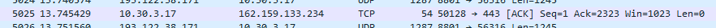

# [ Network detection ]
Scanning network of my Linux machine using nmap. Analyse with Wireshark what happens when I open an internet browser.

In order to prevent or stop attacks on a network, you must be able to analyse your network. There are many tools available to do this, but this exercise will focus on two very popular ones: nmap and Wireshark.

## Key terminology
- Network: A network consists of two or more computers that are linked in order to share resources, exchange files, or allow electronic communications.
- Wireshark: Wireshark is an open-source packet analyzer, which is used for education, analysis, software development, communication protocol development, and network troubleshooting.
- Nmap: Network Mapper (Nmap) is a free, open-source network security scanning tool. By sending IP packets and analyzing the responses, Nmap can discover information about hosts and services on remote computer networks.
- Protocol analyzer: A Protocol Analyzer is a measurement tool or device used to capture and monitor the data over communication channel. It captures the data on the communication channel and coverts the data bits into meaningful protocol sequence.
- Packets: In networking, a packet is a small segment of a larger message. Data sent over computer networks, such as the Internet, is divided into packets. These packets are then recombined by the computer or device that receives them.
- Protocol: In networking, a protocol is a set of rules for formatting and processing data. 

## Exercise
### Sources
- https://www.vectra.ai/learning/ndr#:~:text=Network%20Detection%20and%20response%20(NDR)%20is%20a%20cybersecurity%20solution%20that,integrating%20with%20other%20cybersecurity%20tools%2F
- https://phoenixnap.com/kb/how-to-install-nmap-ubuntu-18-04
- https://www.interviewbit.com/blog/nmap-commands/
- 

### Overcome challenges
I didn't knew the commands for nmap so I had to look them up.

### Results
I installed nmap on my linux machine, found my IP address and used that to scan the network of my Linux machine.

What I found with nmap on my Linux machine:

What I saw in Wireshark when I opened an internet browser:

