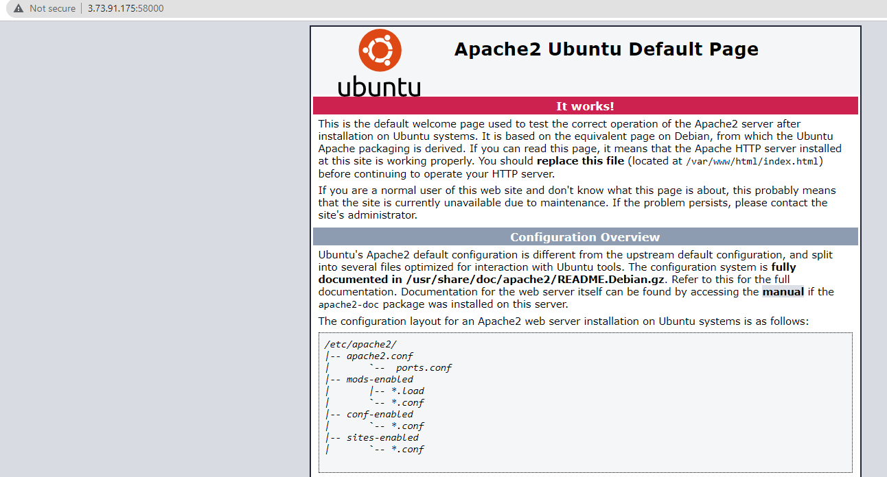
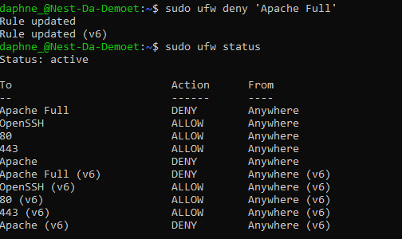
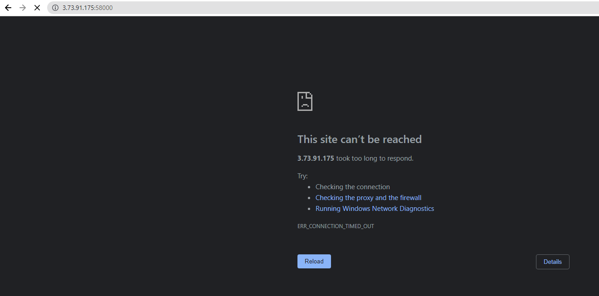

# [ Firewalls ]
Install a webserver on my VM. See the standardpage that the webserver installed. Let the firewall black web traffic but allow ssh traffic and see it the firewall works.

Indtroduction to Firewall; A fire wall is a network security that monitors incomming and outgoing network traffic and has it's own set of security rules. They block malicious traffic. 

## Key terminology
- CentOS: Community Enterprise Operating System is a Linux distribution that provides a free and open-source community-supported computing platform, functionally compatible with its upstream source, Red Hat Enterprise Linux (RHEL).
- RHEL: Red Hat Enterprise Linux is a commercial open-source Linux distribution developed by Red Hat for the commercial market. 
- iptables: Iptables is a firewall program for Linux. It will monitor traffic from and to your server using tables. These tables contain sets of rules, called chains, that will filter incoming and outgoing data packets.
- Stateful: A stateful firewall is a firewall that monitors the full state of active network connections. This means that stateful firewalls are constantly analyzing the complete context of traffic and data packets, seeking entry to a network rather than discrete traffic and data packets in isolation.
- Stateless: Stateless firewalls use packet filtering rules that specify certain match conditions. If match conditions are met, stateless firewall filters will then use a set of preapproved actions to guide packets into the network. If match conditions are not met, unidentified or malicious packets will be blocked. 
- Hardware friewall: A hardware firewall is a physical appliance that is deployed to enforce a network boundary. All network links crossing this boundary pass through this firewall, which enables it to perform inspection of both inbound and outbound network traffic and enforce access controls and other security policies.
- Software firewall: A software firewall is a special type of computer software that runs on a computer/server. Its main purpose is to protect your computer/server from outside attempts to control or gain access and depending on your choice of a software firewall. A software firewall can also be configured for checking any suspicious outgoing requests.

## Exercise
### Sources
- https://www.makeuseof.com/tag/set-apache-web-server-3-easy-steps/
- https://www.cyberciti.biz/faq/star-stop-restart-apache2-webserver/
- https://tipsntricks.in/how-to-fix-apache2-welcome-page-not-showing-in-ubuntu/
- https://www.digitalocean.com/community/tutorials/how-to-set-up-a-firewall-with-ufw-on-ubuntu-20-04

### Overcome challenges
I tried using my private IP first but that didn't work, I had to use the public one with the right port.

### Results

My working default page:

The firewall I put up that blocks web traffic but allows ssh traffic.

The page doens't work when the web traffic is blocked.
