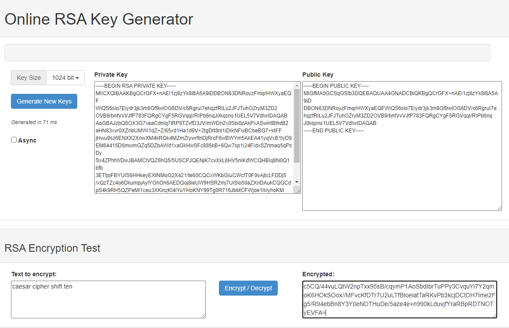
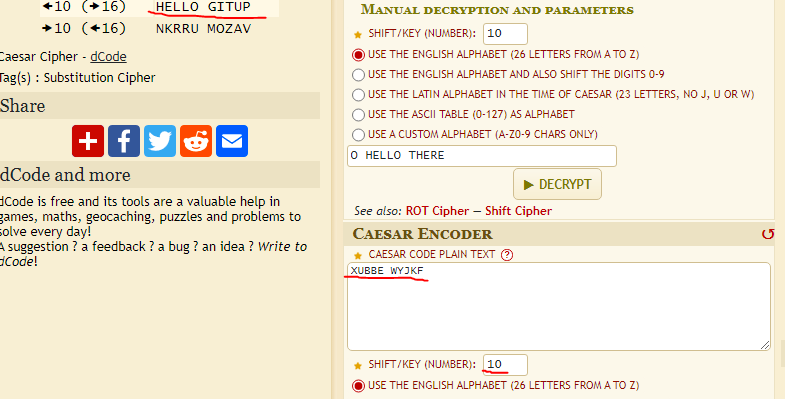

# [ Symmetric encryption ]
Learning about ciphers and symmetrical keys.

## Key terminology
- Ciphers: A system of writing that prevents most people from understanding the message.
- Encryption: Encryption is the method by which information is converted into secret code that hides the information's true meaning. The science of encrypting and decrypting information is called cryptography.
- Symmetrical encryption: Symmetric encryption uses a single key to encrypt and decrypt. If you encrypt a zip file, then decrypt with the same key, you are using symmetric encryption.

## Exercise
### Sources
- https://www.theguardian.com/childrens-books-site/2015/sep/10/top-10-codes-keys-and-ciphers- 
- https://crypto.interactive-maths.com/polyalphabetic-substitution-ciphers.html
- https://www.geeksforgeeks.org/playfair-cipher-with-examples/
- https://www.sciencedirect.com/topics/computer-science/symmetric-encryption#:~:text=Symmetric%20encryption%20uses%20a%20single,kept%20secret%20from%20third%20parties.
- https://security.stackexchange.com/questions/101560/how-to-securely-send-private-keys#:~:text=The%20proper%20way%20to%20do,Private%20Key%20and%20send%20it

### Overcome challenges
I didn't knew how to make sure that your message would be private while only having a private key. I did some research and found out that you need or a private environment or a public key.

### Results

Two historic ciphers:
- Vigenère cipher (1553)
- Atbash ciphers (between -1000 and -500 BC)

Two digital ciphers:
- Polygram Substitution Cipher
- Playfair Cipher

A way to share encryption key without revealing it to everyone is to share the private key in a private environment. 

Shortcomings of this method:
If you can't use a private environment for example, through private messages or other private comminucation options, you can't not ensure you're message is being viewed by others. You should never share private keys in a public environment. This could be solved by using a public key.

The solution would be to use a public key like this:

