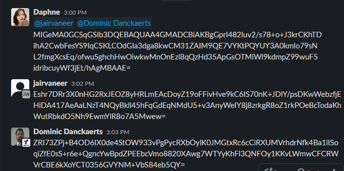
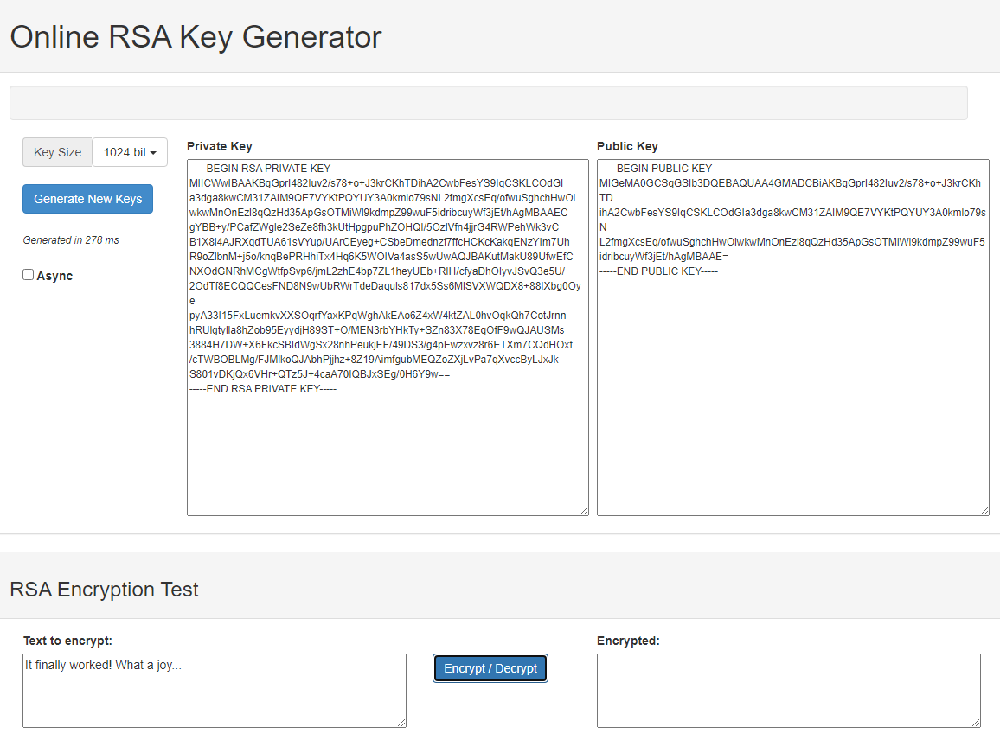
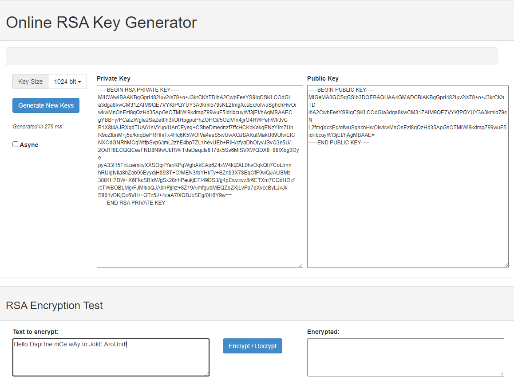

# [ Asymmetric encryption ]
Learning about ciphers and asymmetrical encryption, in the previous assignment we learned about symmetrical encryption.

## Key terminology
- Asymmetrical: Asymmetric Encryption uses two distinct, yet related keys. One key, the Public Key, is used for encryption and the other, the Private Key, is for decryption. As implied in the name, the Private Key is intended to be private so that only the authenticated recipient can decrypt the message.
- Public key: Public key cryptography is a method of encrypting or signing data with two different keys and making one of the keys, the public key, available for anyone to use.
- Private key:  A private key is private, and only made available to the originator of the encrypted content, and those it is shared with.

## Exercise
### Sources
- https://cheapsslsecurity.com/blog/what-is-asymmetric-encryption-understand-with-simple-examples/
- https://www.practicalnetworking.net/series/cryptography/using-asymmetric-keys/
- https://en.m.wikipedia.org/wiki/Public-key_cryptography

### Overcome challenges
I was a little stuck because I didn't knew who needs which key. I found out the person having both public and private keys are the recievers and the ones with the public are the senders and encrypters of the message.

### Results

How asymmetric encryption works:

A wants to receive encrypted messages from B

-  A generates a key-pair (public & private key)
-  A makes its public key public.
-  B encrypts the message with the public key.
-  B posts the encrypted message publicly.
-  A uses the private key to decrypt and read the message.

I generated a key-pair, posted the public key on the public Slack channel and received encrypted messages from Dominic and Jair.

Jair's message:

Dominic's message:

