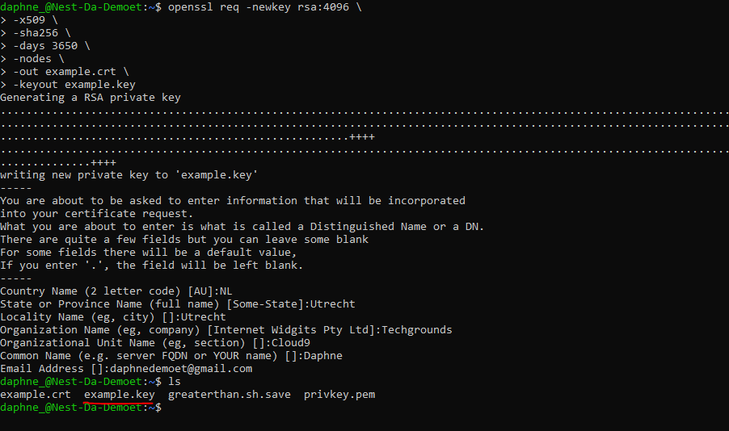
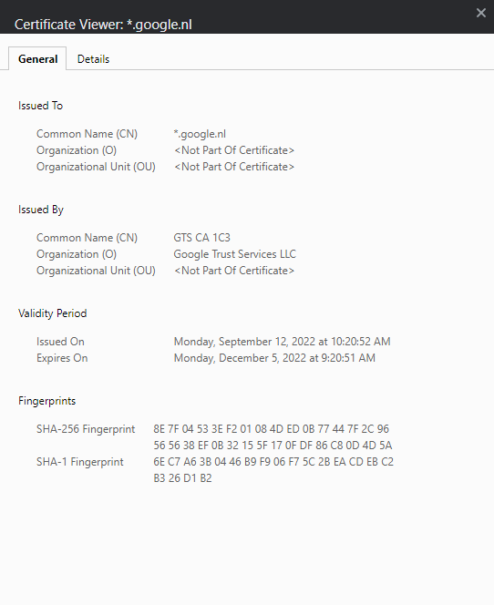
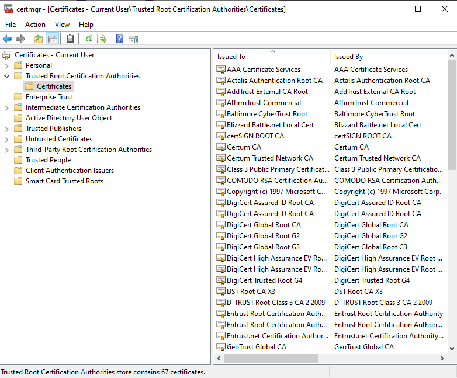

# [ Public Key Infrastructure]
Learning about Public Key Infrastucture, Certifications and creating a self-signed cerfiticate on my VM.

## Key terminology
- PKI: Public key infrastructure (PKI) governs the issuance of digital certificates to protect sensitive data, provide unique digital identities for users, devices and applications and secure end-to-end communications.
- Digital certificates: A digital certificate is a file or electronic password that proves the authenticity of a device, server, or user through the use of cryptography and the public key infrastructure (PKI). 
- X.509: X.509 is a standard defining the format of public-key certificates. X.509 certificates are used in many Internet protocols, including TLS/SSL, which is the basis for HTTPS, the secure protocol for browsing the web.

## Exercise
### Sources
- https://linuxize.com/post/creating-a-self-signed-ssl-certificate/
- https://learn.microsoft.com/en-us/dotnet/framework/wcf/feature-details/how-to-view-certificates-with-the-mmc-snap-in
- https://support.google.com/skillshop/answer/6373437?hl=en

### Overcome challenges
I didn't knew how to make a certificate or how to view it, so I found some sources that explain it well.

### Results

Created a self-signed certificate on my VM:

Certification path of Google:

List of trusted certificate roots on my system:

