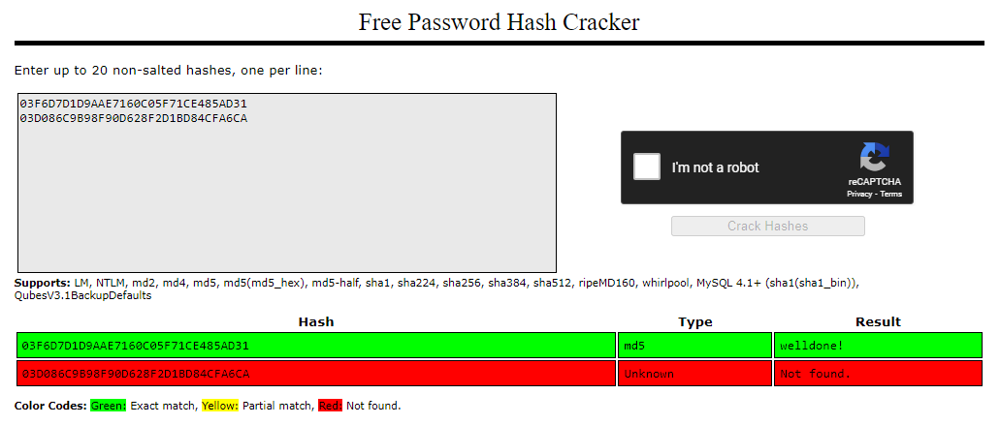
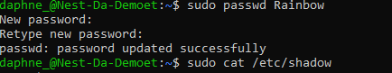
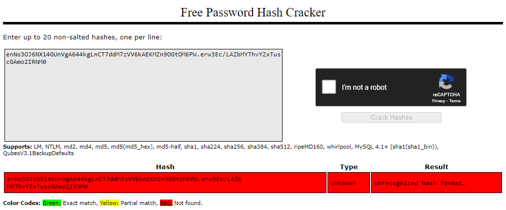

# [ Passwords ]
Learning about password (managers) and hashing. 

## Key terminology
- Authentication: See SEC03 IAM
- Hashing: Hashing is the process of converting a given key into another value. A hash function is used to generate the new value according to a mathematical algorithm. The result of a hash function is known as a hash value or simply, a hash.
- MD5: The MD5 message-digest algorithm is a cryptographically broken but still widely used hash function producing a 128-bit hash value. 
- Rainbow Table: A rainbow table is an efficient way to store data that has been computed in advance to facilitate cracking passwords.
- Salting: Is the expression refers to adding random data to the input of a hash function to guarantee a unique output, the hash, even when the inputs are the same.

## Exercise
### Sources
- https://www.educative.io/answers/what-is-hashing
- https://www.encryptionconsulting.com/education-center/encryption-vs-hashing/
- https://www.geeksforgeeks.org/understanding-rainbow-table-attack/
- https://www.geekyhacker.com/2021/04/11/verify-a-users-password-in-linux/
- https://cyberhoot.com/cybrary/password-salting/
- https://www.makeuseof.com/what-is-salting/

### Overcome challenges
I didn't knew which part of the output the hash was so I had to do research about that. I found out everything between the third `$` and `;` is the hash.

### Results

Why is hashing preferred over symmetric encryption for storing passwords?
Since encryption is two-way, the data can be decrypted so it is readable again. Hashing, on the other hand, is one-way, meaning the plaintext is scrambled into a unique digest, through the use of a salt, that cannot be decrypted and because of that; hashing is safer for storing passwords.

How is Rainbow Table used to crack passwords?
- To crack a password, or for rainbow table attacks, large numbers of hashes are run through a dataset and then through multiple reduction stages to split them into smaller components that are linked to plaintext characters. The plaintext passwords are then stored in the table next to their hashes.

Two MD5 password hashes in a Rainbow Table:

Created a new user; Rainbow with the password '12345'.

The hash in Rainbow, this doesn't work because the password is salted.

Comparing hashes with my teammates.

When you create an account on a website or app, the password you use has to be stored, so you can be verified the next time you visit the site. But this password cannot be stored as plaintext i.e without any form of formatting or coding. The password has to be hashed to prevent hackers from easily accessing your account.

Before that password gets hashed, a salt value is added to it.

The salted password is then hashed and stored in the database alongside other password hashes.