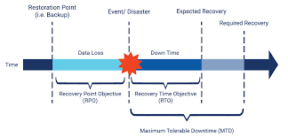

# [ Detection, response and analysis ]
Learning about detection, response and analysis to prevent a malware attack.

## Key terminology
- Malware: As software designed to interfere with a computer's normal functioning, malware is a blanket term for viruses, trojans, and other destructive computer programs threat actors use to infect systems and networks in order to gain access to sensitive information.
- Social engineering: Social engineering is a manipulation technique that exploits human error to gain private information, access, or valuables. In cybercrime, these “human hacking” scams tend to lure unsuspecting users into exposing data, spreading malware infections, or giving access to restricted systems.
- Wireshark: See SEC01 network detection.
- IDS: An intrusion detection system (IDS) is a device or software application that monitors a network for malicious activity or policy violations. Any malicious activity or violation is typically reported or collected centrally using a security information and event management system.
- IPS: An Intrusion Prevention System (IPS), also known as intrusion detection prevention system (IDPS), is a technology that keeps an eye on a network for any malicious activities attempting to exploit a known vulnerability. An Intrusion Prevention System’s main function is to identify any suspicious activity and either detect and allow (IDS) or prevent (IPS) the threat. The attempt is logged and reported to the network managers or Security Operations Center (SOC) staff.
- Cold backup: A cold backup, also called an offline backup, is a database backup during which the database is offline and not accessible to update. This is the safest way to back up because it avoids the risk of copying data that may be in the process of being updated.
- Redundant site: In the event of a failure, redundancy allows your network to remain in service by providing alternative data paths or backup equipment. Network redundancy is introduced to improve reliability and ensure availability. The basic concept that if one device fails, another can automatically take over.
- RPO: Recovery Point Objective (RPO) generally refers to the amount of data that can be lost within a period most relevant to a business, before significant harm occurs, from the point of a critical event to the most preceding backup
- RTO: Recovery Time Objective (RTO) is the duration of time and a service level within which a business process must be restored after a disaster in order to avoid unacceptable consequences associated with a break in continuity.

## Exercise
- 1 A Company makes daily backups of their database. The database is automatically recovered when a failure happens using the most recent available backup. The recovery happens on a different physical machine than the original database, and the entire process takes about 15 minutes. What is the RPO of the database?

- 2 An automatic failover to a backup web server has been configured for a website. Because the backup has to be powered on first and has to pull the newest version of the website from GitHub, the process takes about 8 minutes. What is the RTO of the website?

### Sources
- https://www.barracuda.com/glossary/intrusion-detection-system
- https://www.druva.com/blog/understanding-rpo-and-rto/
- https://www.acc-ict.com/blog/recovery-time-objective-rto-en-recovery-point-objective-rpo

### Overcome challenges
I didn't knew what all the key terms meant and what RPO and RTO was so I had to do some research about it.

### Results

- 1 The RPO, would be the maximum amount of data that can be lost before causing detrimental harm to the organization. They can range between 24 hours down to near zero seconds. In this case the company makes daily backup so their RPO is 24 hours.

- 2 RTO is the duration of time and a service level within which a business process must be restored after a disaster in order to avoid unacceptable consequences associated with a break in continuity. In this case, the process took 8 minutes, therefore their RTO is 8 minutes.

