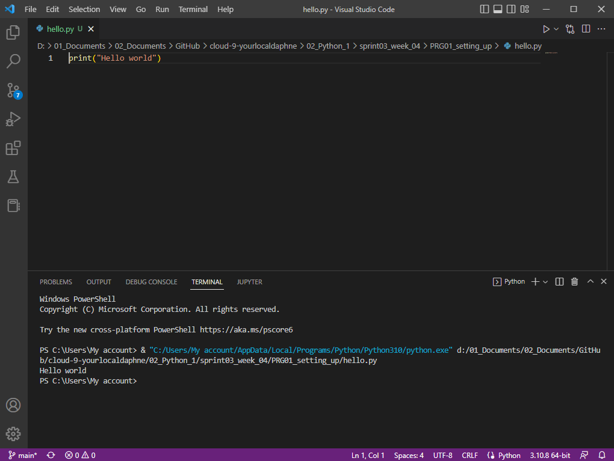

# [ Setting Up]
Learning how to install the latest version of Python and VS code. Learning how to write code and see the output in the teminal.

## Key terminology
- Algorithms: An algorithm is simply a set of steps used to complete a specific task.
- Snippets: Snippet is a programming term for a small region of re-usable source code, machine code, or text. Ordinarily, these are formally defined operative units to incorporate into larger programming modules. Snippet management is a feature of some text editors, program source code editors, IDEs, and related software.
- Python: Python is a computer programming language often used to build websites and software, automate tasks, and conduct data analysis.
- IDE: An integrated development environment (IDE) is software for building applications that combines common developer tools into a single graphical user interface (GUI).
- PATH variable: he PATH variable sets directory paths to look in when commands are executed, both for RUN commands, and for internal calls from programs.
- Syntax: The syntax of a computer language is the rules that defines the combinations of symbols that are considered to be correctly structured statements or expressions in that language. 

## Exercise

- Install the latest version of Python from https://www.python.org/
- Install VS Code from https://code.visualstudio.com/download
- Install the Python plug-in in VS Code.
- Write the following Python code. The output in the terminal should be the text “Hello world!”

### Sources
- https://stackoverflow.com/questions/13596505/python-command-not-working-in-command-prompt
- https://youtu.be/AKVRkB0fot0
- https://youtu.be/lezhrFdVSVY
- https://docs.python.org/3/using/windows.html

### Overcome challenges
My VS code didn't recognise Python at first so I found a very helpful video that added Python installation location to the path environment variable. After that my VS code recognized Python.

### Results

Output when I executed the command `print("Hello world")`

