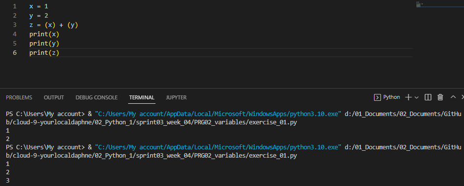
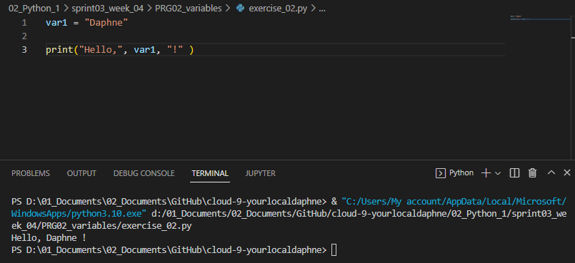
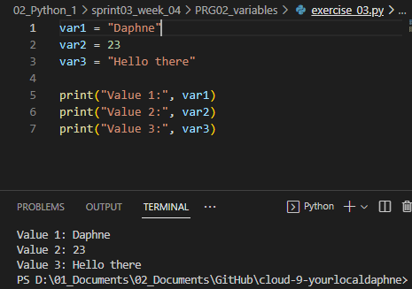

# [ Variables ]
Learning to create scripts and variables with Python and VS code. Learning to assign value to a variable.

## Key terminology
- Value: A value is the representation of some entity that can be manipulated by a program.
- Variable: A variable is a value that can change, depending on conditions or on information passed to the program.
- String: Most programming languages have a data type called a string, which is used for data values that are made up of ordered sequences of characters, such as "hello world". A string can contain any sequence of characters, visible or invisible, and characters may be repeated.

## Exercise
Exercise 1:
- Create a new script.
- Create two variables x and y. Assign a numerical value to both variables.
- Print the values of x and y.
- Create a third variable named z. The value of z should be the sum of x and y.
- Print the value of z.

Exercise 2:
- Create a new script.
- Create a variable name. The value of name should be your name.
- Print the text `“Hello, <your name here>!”`. Use name in the print statement.

Exercise 3:
- Create a new script.
- Create a variable and assign a value to it.
- Print the text “Value 1: <value 1 here>”.
- Change the value of that same variable.
- Print the text “Value 2: <value 2 here>”.
- Change the value of that same variable.
- Print the text “Value 3: <value 3 here>”.

### Sources
- https://www.w3schools.com/python/python_variables.asp
- https://bobbyhadz.com/blog/python-print-variable-name#:~:text=To%20print%20a%20variable's%20name,to%20print%20the%20variable's%20name.
- https://www.folkstalk.com/tech/python-print-value-and-variable-name-with-code-examples/

### Overcome challenges
With exercise 2 it didn't work at first. I found out that I forgot a `,` between my lines so when I added `,` it worked!

### Results

- Exercise 1:

- Exercise 2:

- Exercise 3:

