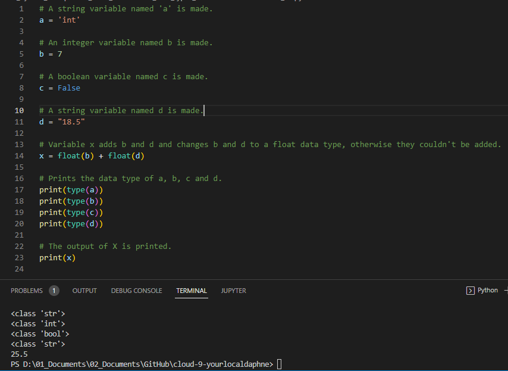

# [ Data types and comments ]
Learning about different data types and wht comments are.

## Key terminology
- Data types: A data type is a classification that specifies which type of value a variable has and what type of mathematical, relational or logical operations can be applied to it without causing an error.
- Boolean: A binary state that is either True or False.
- String: Technically an array of characters. Strings are denoted using “ ” double quotes or ‘ ’ single quotes.
- Int: An integer is a whole number. Ints can be both positive and negative.
- Float: A floating-point number is a decimal number.
- Comments: A comment is a programmer-readable explanation or annotation in the source code of a computer program. They are added with the purpose of making the source code easier for humans to understand, and are generally ignored by compilers and interpreters.

## Exercise
Exercise 1:
- Create a new script.
- Copy the code below into your script.\
a = 'int'\
b = 7\
c = False\
d = "18.5"
- Determine the data types of all four variables (a, b, c, d) using a built in function.
- Make a new variable x and give it the value b + d. Print the value of x. This will raise an error. Fix it so that print(x) prints a float.
- Write a comment above every line of code that tells the reader what is going on in your script.

Exercise 2:
- Create a new script.
- Use the input() function to get input from the user. Store that input in a variable.
- Find out what data type the output of input() is. See if it is different for different kinds of input (numbers, words, etc.).

### Sources
- https://appdividend.com/2022/03/19/how-to-check-data-type-in-python/#:~:text=To%20check%20the%20data%20type,Python%20returns%20the%20data%20type.
- https://www.youtube.com/watch?v=Xdo8N8onpTs
- https://www.scaler.com/topics/addition-of-two-numbers-in-python/

### Overcome challenges
I didn't knew how to fix the error in exercise 1 that you get from trying to `+` a int and a str. I did some research and found an website that explained it.

### Results

- Exercise 1:

- Exercise 2:

