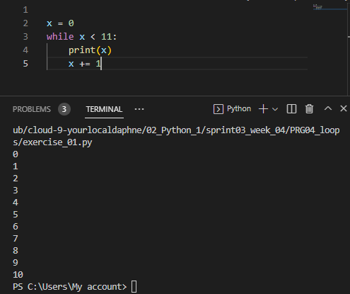
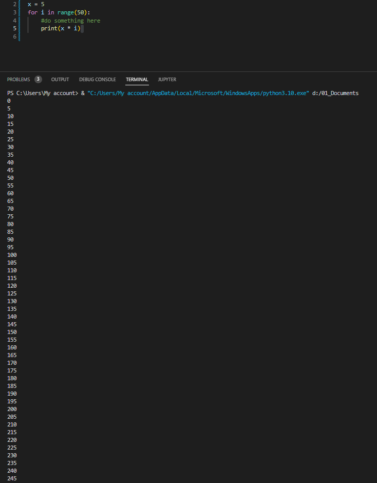
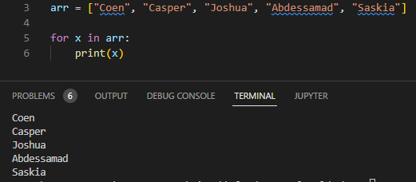

# [ Loops ]
Learning and using Python loops like; While loop and For loop, and print the output.

## Key terminology
- Loops: Python for loops are used to loop through an iterable object (like a list, tuple, set, etc.) and perform the same action for each entry. For example, a for loop would allow us to iterate through a list, performing the same action on each item in the list.
- While loops: The while loop in Python is used to iterate over a block of code as long as the test expression (condition) is true. We generally use this loop when we don't know the number of times to iterate beforehand.
- For loops: A for loop is used for iterating over a sequence (that is either a list, a tuple, a dictionary, a set, or a string). This is less like the for keyword in other programming languages, and works more like an iterator method as found in other object-orientated programming languages.
- Iteration: Repetitive execution of the same block of code over and over is referred to as iteration. 
- Array: Arrays are a fundamental data structure, and an important part of most programming languages. In Python, they are containers which are able to store more than one item at the same time.

## Exercise

Exercise 1:
- Create a new script.
- Create a variable x and give it the value 0.
- Use a while loop to print the value of x in every iteration of the loop. After printing, the value of x should increase by 1. The loop should run as long as x is smaller than or equal to 10.

Exercise 2:
- Create a new script.
- Copy the code below into your script.\
 `for i in range(10):`\
`# do something here`
- Print the value of i in the for loop. You did not manually assign a value to i. Figure out how its value is determined.
- Add a variable x with value 5 at the top of your script.
Using the for loop, print the value of x multiplied by the value of i, for up to 50 iterations.

Exercise 3:
- Create a new script.
- Copy the array below into your script.\
`arr = ["Coen", "Casper", "Joshua", "Abdessamad", "Saskia"]`
- Use a for loop to loop over the array. Print every name individually.

### Sources
- https://www.dataquest.io/blog/python-for-loop-tutorial/#:~:text=What%20Are%20For%20Loops%3F,each%20item%20in%20the%20list.
- https://www.w3schools.com/python/python_while_loops.asp
- https://infopython.com/what-does-for-i-in-range-mean-in-python/#:~:text=To%20simply%20put%20it%2C%20python's,code%20to%20its%20core%20principles.
- https://www.w3schools.com/python/gloss_python_array_loop.asp

### Overcome challenges
I didn't knew the commands for using loops so I had to do some research.

### Results

- Exercise 1:

- Exercise 2:

If there is no value manually set it will start from 0, and in this case will go to 9 because it will make 10 iterations.

- Exercise 3:

