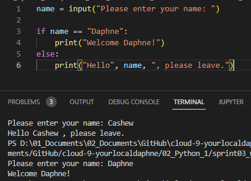
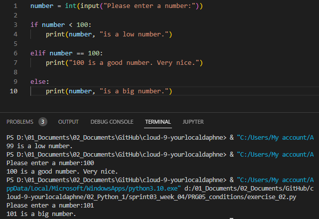
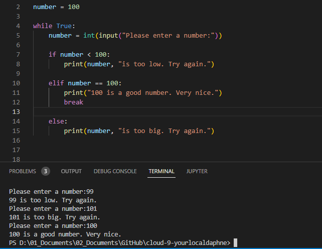

# [ Conditions ]
Learning and using conditions for user input. Using loops till the user's input is right.

## Key terminology
- if: It decides whether certain statements need to be executed or not. It checks for a given condition, if the condition is true, then the set of code present inside the ” if ” block will be executed otherwise not.
- elif: Elif is short for "else if" and is used when the first if statement isn't true, but you want to check for another condition. Meaning, if statements pair up with elif and else statements to perform a series of checks.
- else: The else keyword is used in conditional statements (if statements), and decides what to do if the condition is False.

## Exercise

- Exercise 1:
- Create a new script.
- Use the input() function to ask the user of your script for their name. If the name they input is your name, print a personalized welcome message. If not, print a different personalized message.
#
- Exercise 2:
- Create a new script.
- Ask the user of your script for a number. Give them a response based on whether the number is higher than, lower than, or equal to 100.
- Make the game repeat until the user inputs 100.

### Sources
- https://pythonguides.com/python-ask-for-user-input/
- https://www.w3schools.com/python/python_conditions.asp
- http://www2.lawrence.edu/fast/GREGGJ/CMSC210/loops/if-else.html
- https://www.programiz.com/python-programming/if-elif-else

### Overcome challenges
I used `=` instead of `==` in exercise 1 and gave an error. I found the solutions while researching conditions.

### Results

- Exercise 1:

#
- Exercise 2:

#
Looping till the answer is 100:

