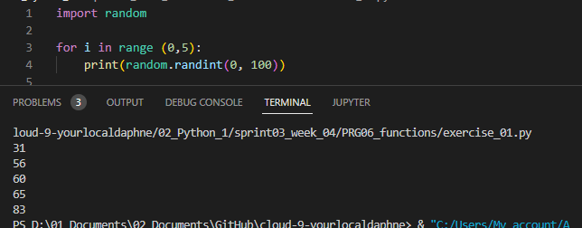
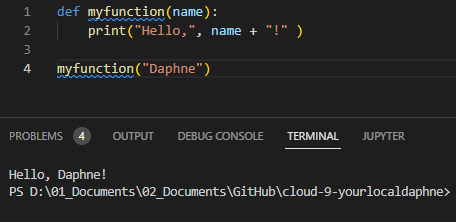
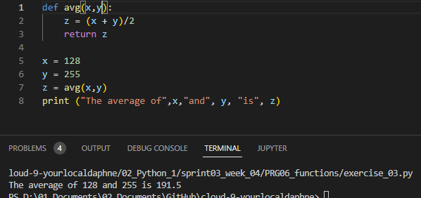

# [ Functions ]
Learning and using functions.

## Key terminology
- Functions:  a function is a group of related statements that performs a specific task. Functions help break our program into smaller and modular chunks. As our program grows larger and larger, functions make it more organized and manageable. Furthermore, it avoids repetition and makes the code reusable.
- Package: A python package is a collection of modules. Modules that are related to each other are mainly put in the same package. When a module from an external package is required in a program, that package can be imported and its modules can be put to use.
- Argument: An argument is the value that are sent to the function when it is called.

## Exercise

- Exercise 1:
- Create a new script.
- Import the random package.
- Print 5 random integers with a value between 0 and 100.

#
- Exercise 2:
- Create a new script.
- Write a custom function `myfunction()` that prints `“Hello, world!”` to the terminal. Call `myfunction`.
- Rewrite your function so that it takes a string as an argument. Then, it should print `“Hello, <string>!”`.

#
- Exercise 3:
- Create a new script.
- Copy the code below into your script.
- `def avg():`\
`#write your code here`\
`x = 128`\
`y = 255`\
`z = avg(x,y)`\
`print ("The average of",x,"and", y, "is", z)`
- Write the custom function avg() so that it returns the average of the given parameters.

### Sources
- https://stackoverflow.com/questions/14985798/python-random-function
- https://pythonprogramminglanguage.com/randon-numbers/
- https://www.digitalocean.com/community/tutorials/how-to-define-functions-in-python-3

### Overcome challenges
I was a little stuck on the last exercise, I knew I needed to use `return` but I was not sure how to. So after a while I found a good source explaining it (last link).

### Results

- Exercise 1:

#
- Exercise 2:

#
- Exercise 3:

