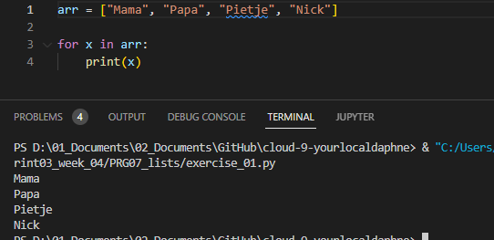
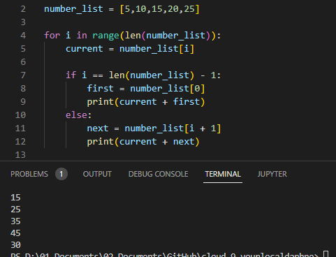

# [ Lists ]
Learning and using lists.

## Key terminology
- Lists: Lists are used to store multiple items in a single variable.
- Square brackets: The square brackets tell Python that this is a list comprehension, producing a list.
- Loop: A for loop in Python is a control flow statement that is used to repeatedly execute a group of statements as long as the condition is satisfied.
- Range: A sequence of numbers.
- Array: They are containers which are able to store more than one item at the same time.

## Exercise

- Exercise 1:
- Create a new script.
- Create a variable that contains a list of five names.
- Loop over the list using a for loop. Print every individual name in the list on a new line.

#
- Exercise 2:
- Create a new script.
- Create a list of five integers.
- Use a for loop to do the following for every item in the list:
- Print the value of that item added to the value of the next item in the list. If it is the last item, add it to the value of the first item instead (since there is no next item).

### Sources
- https://www.w3schools.com/python/python_lists.asp
- https://www.freecodecamp.org/news/python-list-length-how-to-get-the-size-of-a-list-in-python/
- https://www.digitalocean.com/community/tutorials/python-add-to-list

### Overcome challenges
I didn't knew how to add the value of the first item to the last one. I did some research and got help from my teammates.

### Results

- Exercise 1:

#
- Exercise 2:

