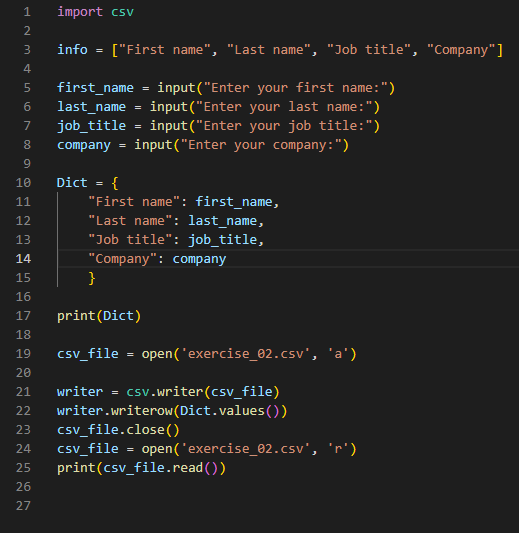
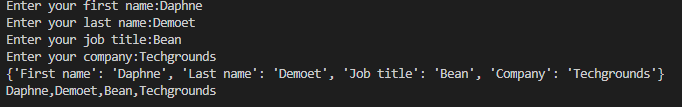

# [ Key value pairs ]
Learning about key value pairs, making a csv file and dictionaries.

## Key terminology
- Key: Keys are analogous to indexes of a list. When using lists you access the elements via the index. With dictionaries you access values via the keys. The keys can be of any datatype (int, float, string, and even tuple).
- Value: Values() is an inbuilt method in Python programming language that returns a view object. The view object contains the values of the dictionary, as a list.
- NoSQL database: NoSQL databases (aka "not only SQL") are non-tabular databases and store data differently than relational tables. NoSQL databases come in a variety of types based on their data model. The main types are document, key-value, wide-column, and graph. They provide flexible schemas and scale easily with large amounts of data and high user loads.
- AWS resource tags: A tag is a label that you assign to an AWS resource. Each tag consists of a key and an optional value, both of which you define.
- Dictionaries: Dictionaries are Python's implementation of a data structure that is more generally known as an associative array. A dictionary consists of a collection of key-value pairs. Each key-value pair maps the key to its associated value.
- {}: In Python, curly braces are used to define a data structure called a dictionary (a key/value mapping), while white space indentation is used to define program blocks.
- csv file: A CSV file (Comma Separated Values file) is a type of plain text file that uses specific structuring to arrange tabular data. Because it's a plain text file, it can contain only actual text data—in other words, printable ASCII or Unicode characters. The structure of a CSV file is given away by its name.

## Exercise
- Exercise 1:
- Create a new script.
- Create a dictionary with the following keys and values:
- Key:
First name
Last name
Job title
Company
- Value:
Casper
Velzen
Lead Learning Coach
Techgrounds
- Loop over the dictionary and print every key-value pair in the terminal.

#
- Exercise 2:
- Create a new script.
- Use user input to ask for their information (first name, last name, job title, company). Store the information in a dictionary.
- Write the information to a csv file (comma-separated values). The data should not be overwritten when you run the script multiple times.

### Sources
- https://www.w3schools.com/python/gloss_python_loop_dictionary_items.asp
- https://www.w3schools.com/python/python_dictionaries.asp
- https://realpython.com/python-dicts/
- https://www.geeksforgeeks.org/python-dictionary/

### Overcome challenges
I wasn't sure how to import csv in Python but I found out I could do that through a command.

### Results

- Exercise 1:

#
- Exercise 2:

