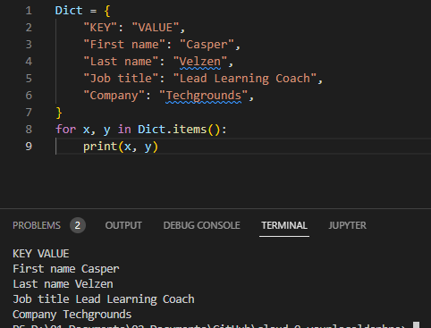

# [ Key value pairs ]

## Key terminology
- 

## Exercise
- Exercise 1:
- 

#
- Exercise 2:
- 

### Sources
- https://www.w3schools.com/python/gloss_python_loop_dictionary_items.asp
- https://www.w3schools.com/python/python_dictionaries.asp
- https://realpython.com/python-dicts/
- https://www.geeksforgeeks.org/python-dictionary/

### Overcome challenges

### Results

- Exercise 1:

#
- Exercise 2:

