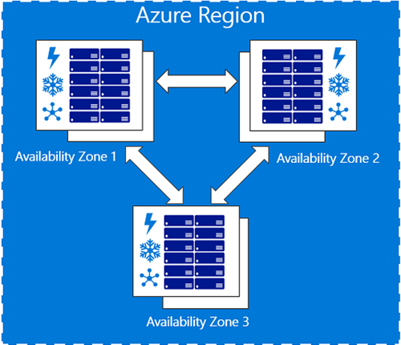
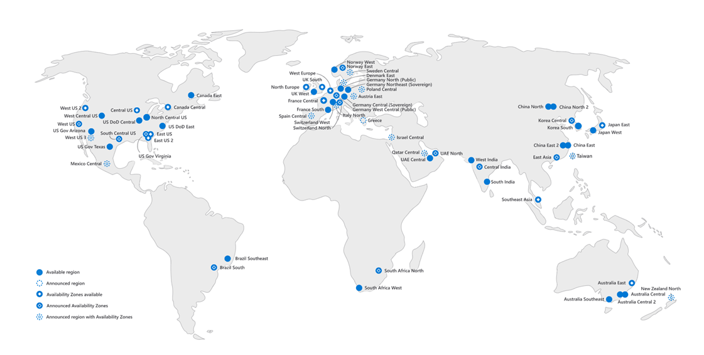
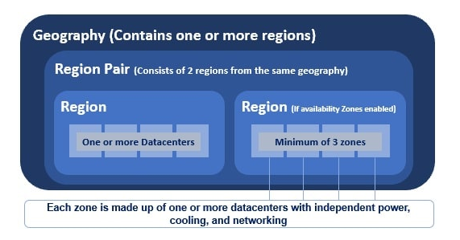

# [ Global Infrastructure ]
Learning and researching about Azure's global infrastructure and it's components.

## Key terminology
- Cloud:\
 "The cloud" refers to servers that are accessed over the Internet, and the software and databases that run on those servers.
- Servers:\
 A server stores, sends, and receives data. In essence, it "serves" something else and exists to provide services. A computer, software program, or even a storage device may act as a server, and it may provide one service or several.
- Networking:\
 Computer networking refers to interconnected computing devices that can exchange data and share resources with each other. These networked devices use a system of rules, called communications protocols, to transmit information over physical or wireless technologies.
- Physical infrastructure:\
 Physical infrastructure includes power, backup generators, Heating Ventilating and Air Conditioning, surge control systems, connectivity (cabling), hardware, software, and people. The physical systems are vulnerable to surveillance, vandalism, sabotage, and attack.
- Virtual infrastructure:\
 A virtual infrastructure provides the same IT capabilities as physical resources, but with software, so that IT teams can allocate these virtual resources quickly and across multiple systems, based on the varying needs of the enterprise.
- Azure subscriptions: \
An Azure subscription is tied to a single account, the one that was used to create it and is also used for billing. Resources can be supplied as instances of the many Azure products and services under the subscription. Free, pay-as-you-go, and member offers are the three primary types of subscriptions accessible.
- Low-latency network: \
Low latency describes a computer network that is optimized to process a very high volume of data messages with minimal delay (latency). These networks are designed to support operations that require near real-time access to rapidly changing data.
- Datacenter: \
A data center is a facility that centralizes an organization's shared IT operations and equipment for the purposes of storing, processing, and disseminating data and applications.
- Compliance requirements: \
IT compliance describes adherence to legal, internal, or contractually prescribed requirements for the IT of an organization. These requirements are made up of various requirements for IT security, data protection, availability, and integrity that apply to systems and processes.
#
## Exercise
Study:
- What is an Azure Region?
- What is an Azure Availability Zone?
- What is an Azure Region Pair?
- Why choose one region over another?
#
### Sources
- https://cswsolutions.com/blog/posts/2021/september/azure-regions-what-they-are-why-they-matter/#:~:text=An%20Azure%20region%20is%20a,discrete%20pricing%20and%20service%20availability.
- https://www.pragimtech.com/blog/azure/azure-regions-and-paired-regions/
- https://www.youtube.com/playlist?list=PL6n9fhu94yhVIhqTz-LBfwgz_Amz7rRLp
- https://learn.microsoft.com/en-us/azure/cloud-adoption-framework/migrate/azure-best-practices/multiple-regions
- https://www.websitebuilderinsider.com/which-azure-region-should-i-use/

#
### Overcome challenges
I didn't knew about the topics yet so I did research to understand them.
#

### Results 
## What is an Azure Region?

An Azure Region are a set of datacenter that are connected through a dedicated low-latency network. Costumers have the flexibility to deploy applications where they need. Each Azure geography has it's own region that meet specified data positions and compliance requirements.

A Region could be made up of just 1 dataceneter or multiple datacenters.

#
## What is an Azure Availability Zone?

Azure Availability Zones are unique physical locations within an Azure region that offer high availability to protect your applications and data from datacenter failures. Each zone is made up of datacenters that are equipped with independent power, cooling, and networking.

 They replicate your apps/data across Azure Availability Zone to protect from single points of failure.

 Not all Regions have Availability Zones.

#
## What is an Azure Region Pair?

An Azure Regional Pair consists of two regions within the same geography. 

Azure geography is an area of the world that contains one or more Azure Regions. For example, India, United States, Europe, Asia Pacific are a few examples of Azure Geographies. 

An azure region is made up of one or more datacenters. If availability zones are enabled, an azure region contains a minimum of three availability zones. An Availability Zone is made up of one or more datacenters. So, an Azure region contains one or more datacenters or 3 or more availability zones if enabled.

Most regions in a geography are paired to ensure business continuity and disaster recovery.

Regions in a Region Pair are determined by Microsoft. We do not have any control over it. However, you are not limited to using just the regions in one given region pair.

#

## Why choose one region over another?

North America is the most popular Azure region, and it offers the best performance and availability.

You want to choose a region based on: location, available services, capacity, constraints and sovereignty.

When selecting an Azure region, consider the location of your users, the compliance and regulatory requirements of your workloads, the latency requirements of your application, and the pricing for the services you plan to use. Also, be aware that some Azure regions are physically located in multiple countries.

The Azure services you can deploy in each region differ depending on various factors.

Each region has a maximum capacity. A region's maximum capacity might affect what types of subscriptions can deploy what types of services and under what circumstances. Regional capacity is different from a subscription quota.

Certain constraints are placed on the deployment of services in certain regions. For example, some regions are available only for backup or failover.

Certain regions are dedicated to specific sovereign entities. Although all regions are Azure regions, these sovereign regions are isolated from the rest of Azure. They aren't necessarily managed by Microsoft, and they might be restricted to certain types of customers.

