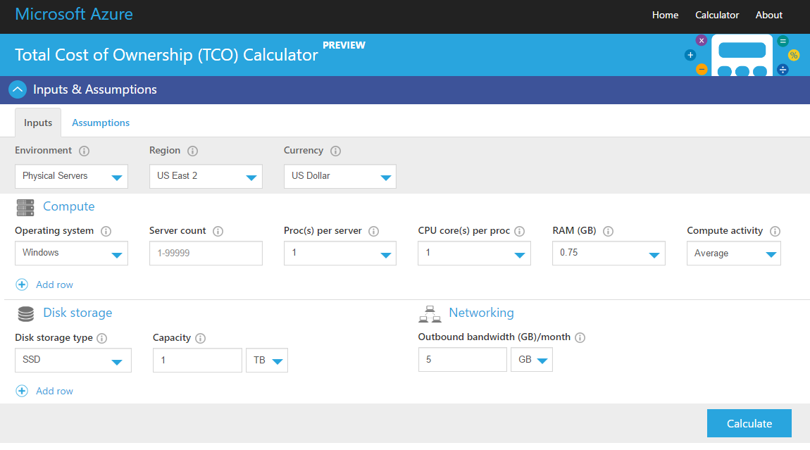

# [ Cost Management ]
Learning about the cost of using Azure's services and subscription and creating an alert to monitor your Cloud pass.

## Key terminology
- Cost management:\
Cost management is the process of planning and controlling the costs associated with running a business.
- TCO:\
TCO (Total Cost of Ownership) is the overall cost of a product or service throughout its life cycle.
- Planning:\
Planning is the process of deciding in detail how to do something before you actually start to do it.
- Visibility:\
The quality or state of being visible
- Optimization:\
An act, process, or methodology of making something (such as a design, system, or decision) as fully perfect, functional, or effective as possible
- Iteration:\
The process of doing something again and again, usually to improve it, or one of the times you do it
#
## Exercise
Study:
- The Azure principles for cost management.
- The terms of the "Free subscription".
- The difference between CAPEX and OPEX.
- The TCO calculator.

Assignment:
- Create an alert that allows you to monitor your own Cloud Pass.
- Understand the options Azure offers to see your spending.
#
### Sources
- https://learn.microsoft.com/en-us/azure/architecture/framework/cost/principles
- https://spot.io/resources/azure-pricing/azure-cost-management-4-ways-to-optimize-azure-costs/
- https://learn.microsoft.com/en-us/azure/cost-management-billing/manage/avoid-charges-free-account
- https://www.investopedia.com/ask/answers/112814/whats-difference-between-capital-expenditures-capex-and-operational-expenditures-opex.asp#:~:text=CapEx%20vs.-,OpEx%3A%20An%20Overview,to%20keep%20its%20business%20operational.

#
### Overcome challenges
I didn't knew anything about the topics of today so I did some research through the sources that I linked.
#

## Results 

### Azure principles for cost management:

- Planning\
Set up a budget and maintain cost constraints. Consider the budget constraints set by the company, before choosing: An architectural pattern, Azure service and a price model for the service
- Visibility\
How many entities will see your application/data and where are they located. This needs to be taken in to account when choosing the right services.
- Accountability\
 The workload responsibilities vary depending on whether the workload is hosted on Software as a Service (SaaS), Platform as a Service (PaaS), Infrastructure as a Service (IaaS), or in an on-premises datacenter.
- Optimization\
To provision resources dynamically and to scale with demand: Conduct regular cost reviews,Measure capacity needs and Forecast capacity needs.
- Iteration
 
#
### The terms of the "Free subscription":

New users get $200 Azure credit in your billing currency for the first 30 days and a limited quantity of free services for 12 months with your Azure free account.

You get a limited quantity of free services each month with your Azure free account. The free quantity expires at the end of the month and doesn't roll over to the next month. For example, you get 5 GB of File storage each month. If in a month, you only use 2 GB, the remaining 3 GB doesn't roll over to the next month.
#
### The difference between CAPEX and OPEX:

CAPEX: Capital expenditures (CapEx) are purchases of significant goods or services that will be used to improve a company’s performance in the future. They include the cost of fixed assets and the acquisition of intangible assets such as patents and other forms of technology.

Example: Manufacturing plants, equipment, machinery, building improvements, computers, vehicles and trucks.

OPEX: Operating expenses are the costs that a company incurs for running its day-to-day operations. These expenses must be ordinary and customary costs for the industry in which the company operates. Companies report OpEx on their income statements and can deduct OpEx from their taxes for the year when the expenses were incurred.

Examples: Rent, utilities, wages, salaries, accounting, legal fees, overhead costs such as selling, general, administrative expenses (SG&A), property taxes, business travel and interest paid on debt.

#
### The TCO calculator:

This video explains the Azure TCO calculator: https://www.youtube.com/watch?v=pE-bf8i5blU

This is what the calculator looks like:

#
### Create an alert that allows you to monitor your own Cloud Pass.

