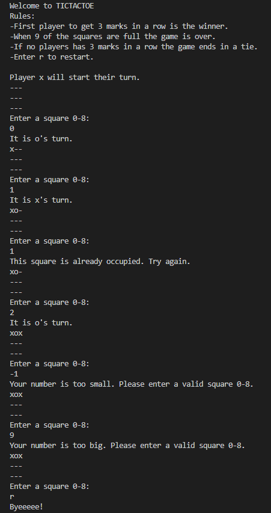

# [ Mini Project ]
Learning more about Python while creating a game. You can choose from number-guessing, rock-paper-scissors or tictactoe. For this project I choose tictactoe. the hardest game to make to challenge myself.

## Key terminology
- if loop: Python if Statement is used for decision-making operations. It contains a body of code which runs only when the condition given in the if statement is true. If the condition is false, then the optional else statement runs which contains some code for the else condition.
- while loop: A while loop is a control flow statement which allows code to be executed repeatedly, depending on whether a condition is satisfied or not. As long as some condition is true, 'while' repeats everything inside the loop block. It stops executing the block if and only if the condition fails.
- variable: A Python variable is a symbolic name that is a reference or pointer to an object. Once an object is assigned to a variable, you can refer to the object by that name. But the data itself is still contained within the object.
- value: Values() is an inbuilt method in Python programming language that returns a view object. The view object contains the values of the dictionary, as a list.
- input: Python input() function is used to take user input. By default, it returns the user input in form of a string.
- true/false: The Python Boolean type is one of Python's built-in data types. It's used to represent the truth value of an expression. For example, the expression 1 <= 2 is True , while the expression 0 == 1 is False .==.
- int: The int() function returns the numeric integer equivalent from a given expression. Expression whose numeric integer equivalent is returned.
- str: The str() function converts values to a string form so they can be combined with other strings. The "print" function normally prints out one or more python items followed by a newline.
- if:  It decides whether certain statements need to be executed or not. It checks for a given condition, if the condition is true, then the set of code present inside the ” if ” block will be executed otherwise not.
- else: The else keyword is used in conditional statements (if statements), and decides what to do if the condition is False.
- except: Except is used to catch and handle the exception(s) that are encountered in the try clause. else lets you code sections that should run only when no exceptions are encountered in the try clause.
- %: The % symbol in Python is called the Modulo Operator. It returns the remainder of dividing the left hand operand by right hand operand. It's used to get the remainder of a division problem.

## Exercise
- Tic-Tac-Toe:
- Generate a 3x3 board on the command line.
- This is a 2-player game, where one player inputs “X” and the other player inputs “O”.
- Bonus: create a single-player version that you can play against the computer.

### Sources
- https://www.youtube.com/watch?v=Q6CCdCBVypg
- https://www.youtube.com/watch?v=dK6gJw4-NCo
- https://medium.com/byte-tales/the-classic-tic-tac-toe-game-in-python-3-1427c68b8874
- https://replit.com/@aaron_bernath/PythonTicTacToeApp#main.py
- https://www.tutorialspoint.com/python/comparison_operators_example.htm
- https://automatetheboringstuff.com/2e/chapter8/
- https://stackoverflow.com/questions/45735530/implementing-error-message-when-input-is-out-of-range-in-a-list-python
- https://www.codegrepper.com/code-examples/python/how+to+choose+a+random+number+between+two+numbers+in+python
- https://www.w3schools.com/python/python_for_loops.asp#:~:text=To%20loop%20through%20a%20set,ends%20at%20a%20specified%20number.

### Overcome challenges
I don't have much experience with Python yet so I wanted to challenge myself, I didn't knew how to do a lot of things like making the board or making 2 players take turns. I watched a lot of tutorials and read through a lot of articles. I was a bit overwhelmed by everything that had to be in the game so I broke it down to little pieces till it wasn't overwhelming anymore.

### Results



```board = ["-"]*9
currentPlayer = "x"
print("Welcome to TICTACTOE\nRules:\n-First player to get 3 marks in a row is the winner.\n-When 9 of the squares are full the game is over. \n-If no players has 3 marks in a row the game ends in a tie.\n-Enter r to restart.\n\nPlayer x will start their turn. ")

#game board.
def draw():
    counter = 0
    for square in board:
        #if squares show 3 next to each other, it creates a new line.
        print(square, end = "")
        counter = counter + 1
        if counter % 3 == 0:
            print()
        
        
#switching turns.
def switchPlayer():
    global currentPlayer
    if currentPlayer == "x":
        currentPlayer = "o"
    else:
        currentPlayer = "x"


#showing the players who's turn it is
def whoTurn():
    if currentPlayer == "x":
        print("It is x's turn.")
    else:
        print("It is o's turn.")


#playing the game
while True:
    #draw the game board.
    draw()
    #get current player input.
    print("Enter a square 0-8:")
    try:
        user_input = input()
        if user_input == 'r':
            print("Byeeeee!")
            exit()
        choice = int(user_input)
        #players can't choose numbers less than 0 or bigger than 8.
        if choice > 8:
            print("Your number is too big. Please enter a valid square 0-8.")
            continue
        if choice < 0:
            print("Your number is too small. Please enter a valid square 0-8.")
            continue
    #players can't enter letters.
    except ValueError:
        print("You didn't enter a number. Please enter a valid square 0-8.")

    #players can't chose filled squares.
    if board[choice] == "-":
        board[choice] = currentPlayer
        switchPlayer()
        whoTurn()
    else:
        print("This square is already occupied. Try again.")```

