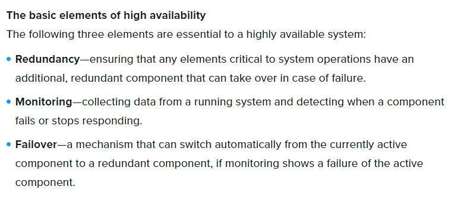
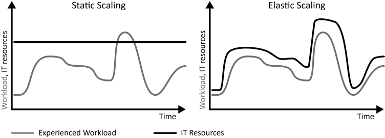
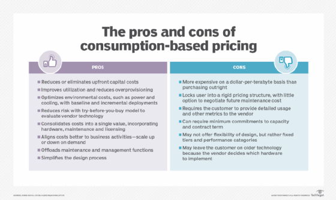

# [ Cost Management ]
Learning about the benefits of the cloud and consumption-base model.

## Key terminology
- Cloud:\
 "The cloud" 
#
## Exercise
Study:
- The 6 benefits of the Cloud
- The consumption-based model

#
### Sources
- https://learn.microsoft.com/en-us/azure/architecture/framework/cost/design-price
- https://marczak.io/az-900/episode-04/cheat-sheet/
- https://www.optisolbusiness.com/insight/6-advantages-of-microsoft-azure-cloud-services
- https://www.business.qld.gov.au/running-business/digital-business/online-risk-security/cloud-computing/benefits
- https://cloud.netapp.com/blog/azure-high-availability-basic-concepts-and-a-checklist
- https://cloudcomputingtechnologies.com/key-advantages-of-cloud-agility/#:~:text=Cloud%20agility%20ensures%20that%20businesses,security%2C%20monitoring%2C%20and%20analysis.
- 

#
### Overcome challenges
I didn't knew enough about the topics yet so I did research to understand them better.
#

## Results 

### The 6 benefits of the Cloud:

- High Availability\
High availability is a quality of computing infrastructure that allows it to continue functioning, even when some of its components fail.

- Scalability\
Your business can scale up or scale down your operation and storage needs quickly to suit your situation, allowing flexibility as your needs change.

- Elasticity\
As the workload resource demands increase, we can go a step further and add rules that automatically add instances. As workload resource demands decrease; again, we could have rules that start to scale in those instances when it is safe to do so without giving the user a performance impact.

- Agility\
Cloud agility ensures that businesses are empowered to priorities issues. Instead of spending valuable time and heaps of money on provisioning and maintaining IT resources, cloud agility shifts emphasis to security, monitoring, and analysis.

- Geo-distribution\
For capacity-intensive workloads, users need fast, local access to data. Locate Regions near data users or data sources to minimize latency and network traffic while maximizing throughput.

- Disaster recovery\
Azure offers an end-to-end backup and disaster recovery solution that is simple, secure, scalable, and cost-effective – and can be integrated with on-premises data protection solutions. The Azure backup and disaster recovery solution is simple to architect, cloud-native, highly available, and resilient.

#
### The consumption-based model:

- Consumption-based price:\
You are charged for only what you use. This model is also known as the Pay-As-You-Go rate. \
There are no upfront costs nor wasted resources. You pay for what you need and stop paying when you don't need it.

#

