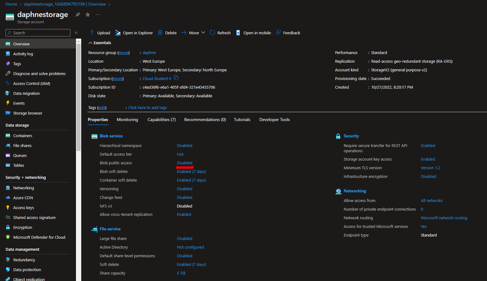
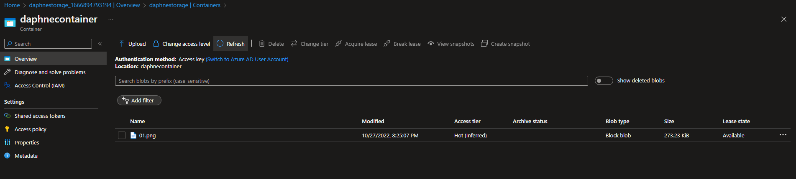
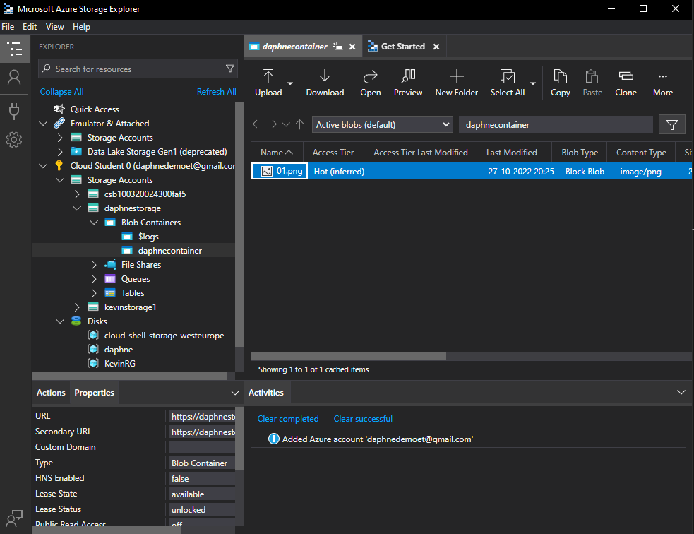

# [ Azure Storage Account ]
Learning about the Azure Storage Accounts and data objects.

## Key terminology
- blobs:\

- files:\

- disks:\

- tables:\

- HTTP:\

- HTTPS:\

- Azure Storage explorer:\

- IaaS :\

- PaaS  :\

#
## Exercise

- Maak een Azure Storage Account. Zorg dat alleen jij toegang hebt tot de data.
- Plaats data in een storage service naar keuze via de console (bijvoorbeeld een kattenfoto in Blob storage).
- Haal de data op naar je eigen computer door middel van de Azure Storage Explorer.

#
### Sources
- https://learn.microsoft.com/en-us/azure/storage/common/storage-private-endpoints
- https://learn.microsoft.com/nl-nl/azure/storage/blobs/storage-blobs-introduction
- https://learn.microsoft.com/nl-nl/azure/storage/blobs/quickstart-storage-explorer

#
### Overcome challenges
I didn't knew how to use the Azure Storage Explorer so I looked up a tutorial.
#

## Results 

