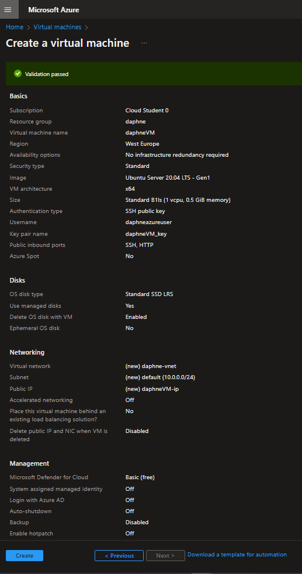
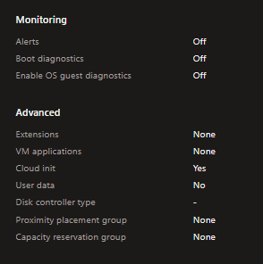
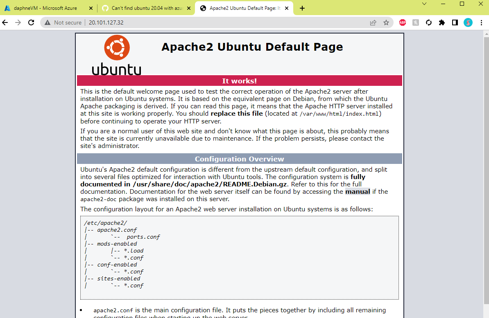

# [ Azure Virtual Machines ]
Learning about Azure Virtual Machines, how to make one and how to run server.

## Key terminology
- Azure Virtual Machines:\
An Azure virtual machine is an on-demand, scalable computer resource that is available in Azure. Virtual machines are generally used to host applications when the customer requires more control over the computing environment than what is offered by other compute resources.
- NIC network security group:\
A network security group (NSG) in Azure is the way to activate a rule or access control list (ACL), which will allow or deny network traffic to your virtual machine instances in a virtual network.
- subnet:\
A subnet is a range of IP addresses in the virtual network. You can divide a virtual network into multiple subnets for organization and security. Each NIC in a VM is connected to one subnet in one virtual network.
- instance:\
An instance in Azure can be understood as a Virtual Machine. Microsoft Azure Websites can be defined as a high-density, multi-tenancy platform.
- Custom Data:\
 Custom data is sent to the VM along with the other provisioning configuration information such as the new hostname, username, password, certificates and keys, etc.
- cloud-init script:\
cloud-init is a widely used approach to customize a Linux VM as it boots for the first time. You can use cloud-init to install packages and write files, or to configure users and security.

#
## Exercise
- Log in bij je Azure Console.
- Maak een VM met de volgende vereisten:\
Ubuntu Server 20.04 LTS - Gen1\
Size: Standard_B1ls\
Allowed inbound ports:\
HTTP (80)\
SSH (22)\
OS Disk type: Standard SSD\
Networking: defaults\
Boot diagnostics zijn niet nodig\
Custom data: \
	#!/bin/bash\
sudo su\
apt update\
apt install apache2 -y\
ufw allow 'Apache'\
systemctl enable apache2\
systemctl restart apache2
- Controleer of je server werkt.
- Let op! Vergeet na de opdracht niet alles weer weg te gooien. Je kan elk onderdeel individueel verwijderen, of je kan in 1 keer de resource group verwijderen.

#
### Sources
- https://learn.microsoft.com/en-us/azure/virtual-machines/windows/quick-create-portal

#
### Overcome challenges
No challenges.
#

## Results 

