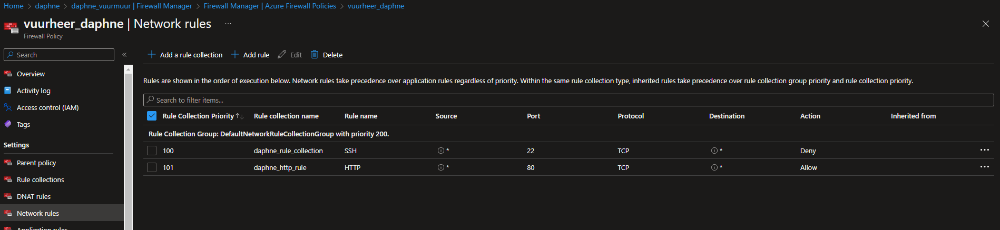

# [ Firewalls ]
Learning about firewalls and servers.

## Key terminology
- Basic firewall:\
Azure Firewall is a cloud-native and intelligent network firewall security service that provides the best of breed threat protection for your cloud workloads running in Azure. It's a fully stateful, firewall as a service with built-in high availability and unrestricted cloud scalability.
- Premium Firewall:\
Azure Firewall Premium provides signature-based IDPS to allow rapid detection of attacks by looking for specific patterns, such as byte sequences in network traffic, or known malicious instruction sequences used by malware.
- stateless:\
Stateless firewalls make use of a data packet's source, destination, and other parameters to figure out whether the data presents a threat. These parameters have to be entered by either an administrator or the manufacturer via rules they set beforehand. 
- stateful:\
Stateful firewalls monitor all aspects of the traffic streams, their characteristics and communication channels. These firewalls can integrate encryption or tunnels, identify TCP connection stages, packet state and other key status updates.

#
## Exercise
- Zet een webserver aan. Zorg dat de poorten voor zowel SSH als HTTP geopend zijn
- Maak een Azure Firewall in VNET. Zorg ervoor dat je webserver nog steeds bereikbaar is via HTTP, maar dat SSH geblokkeerd wordt.

#
### Sources
- https://learn.microsoft.com/en-us/answers/questions/54781/unable-to-deny-traffic-via-ssh-using-azure-applica.html
- https://docs.bridgecrew.io/docs/bc_azr_networking_3
- https://learn.microsoft.com/en-us/azure/firewall/overview

#
### Overcome challenges
I didn't knew enough about the topics yet so I did research to understand them better.
#

## Results 

