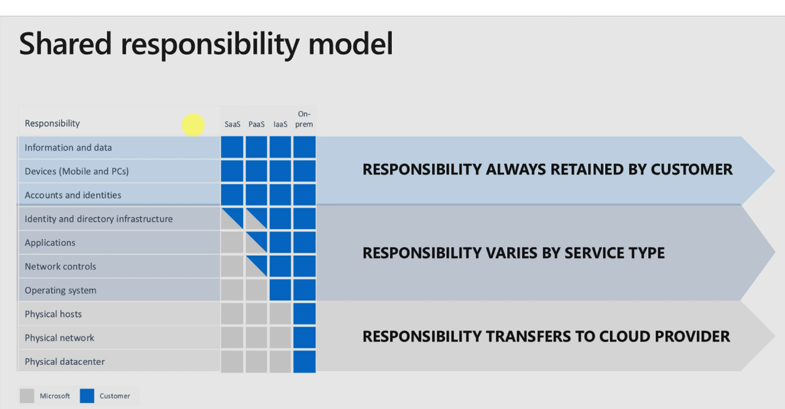

# [ Shared responsibility model ]
Learning more about shared responsibility model.

## Key terminology
- PaaS:\
Platform as a service. Platform as a service (PaaS) is a complete development and deployment environment in the cloud, with resources that enable you to deliver everything from simple cloud-based apps to sophisticated, cloud-enabled enterprise applications.
- IaaS:\
Infrastructure as a service (IaaS) is a type of cloud computing service that offers essential compute, storage, and networking resources on demand, on a pay-as-you-go basis. IaaS is one of the four types of cloud services, along with software as a service (SaaS), platform as a service (PaaS), and serverless.
- SaaS:\
Software as a service (or SaaS) is a way of delivering applications over the Internet—as a service. Instead of installing and maintaining software, you simply access it via the Internet, freeing yourself from complex software and hardware management.
- Onprem:\
“On premises,” also referred to as “on-premise,” “on-premises,” or “on-prem,” is a method of deploying software. With on-prem, computer programs are installed right on users' computers through CDs or USB drives. Whereas with off-premise, the installer can be found anywhere on the Web.

#
## Exercise
Study:
- The shared responsibility model

#
### Sources
- https://www.youtube.com/watch?v=vb2yKWihDwc
- https://learn.microsoft.com/en-us/azure/security/fundamentals/shared-responsibility
- https://www.youtube.com/watch?v=EfoLct9AyKA

#
### Overcome challenges
I didn't knew enough about the shared disks yet so I did research to understand them better. 
#

## Results 

### You always control:
- Data
- Endpoints
- Account
- Access management

