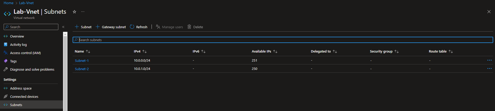

# [ Virtual Network ]
Learning more about VM, Vnet and subnets.

## Key terminology
- VNet:\
Azure Virtual Network (VNet) is the fundamental building block for your private network in Azure. VNet enables many types of Azure resources, such as Azure Virtual Machines (VM), to securely communicate with each other, the internet, and on-premises networks.
- UDR:\
User Defined Routing (UDR)
Each subnet in Azure can be linked to a UDR table used to define how traffic initiated in that subnet is routed. If no UDRs are defined, Azure uses default routes to allow traffic to flow from one subnet to another.
- Point-to-site VPNs:\
A Point-to-Site (P2S) VPN gateway connection lets you create a secure connection to your virtual network from an individual client computer. A P2S connection is established by starting it from the client computer.
- Site-to-site VPNs:\
A Site-to-Site VPN gateway connection is used to connect your on-premises network to an Azure virtual network over an IPsec/IKE (IKEv1 or IKEv2) VPN tunnel. This type of connection requires a VPN device located on-premises that has an externally facing public IP address assigned to it.
- Azure Expressroute:\
ExpressRoute lets you extend your on-premises networks into the Microsoft cloud over a private connection with the help of a connectivity provider. With ExpressRoute, you can establish connections to Microsoft cloud services, such as Microsoft Azure and Microsoft 365.

#
## Exercise 1
- Maak een Virtual Network met de volgende vereisten:\
Region: West Europe\
Name: Lab-VNet\
IP range: 10.0.0.0/16\
- Vereisten voor subnet 1:\
Name: Subnet-1\
IP Range: 10.0.0.0/24\
Dit subnet mag geen route naar het internet hebben
- Vereisten voor subnet 2:\
Name: Subnet-2\
IP Range: 10.0.1.0/24

## Exercise 2
- Maak een VM met de volgende vereisten:\
Een apache server moet met de volgende custom data geïnstalleerd worden:\
#!/bin/bash\
sudo su\
apt update\
apt install apache2 -y\
ufw allow 'Apache'\
systemctl enable apache2\
systemctl restart apache2\
Er is geen SSH access nodig, wel HTTP
- Subnet: Subnet-2\
Public IP: Enabled
- Controleer of je website bereikbaar is

#
### Sources
- https://www.youtube.com/watch?v=zIdwpFZQfmk
- https://learn.microsoft.com/nl-nl/azure/virtual-network/virtual-network-manage-subnet
- https://learn.microsoft.com/nl-nl/azure/virtual-network/nat-gateway/nat-gateway-resource

#
### Overcome challenges
At first the website didn't work, after some Googling I found out it was because I didn't had a NAT gateway, so I assigned Subnet-2 to the NAT gateway and it worked.
#

## Results 

