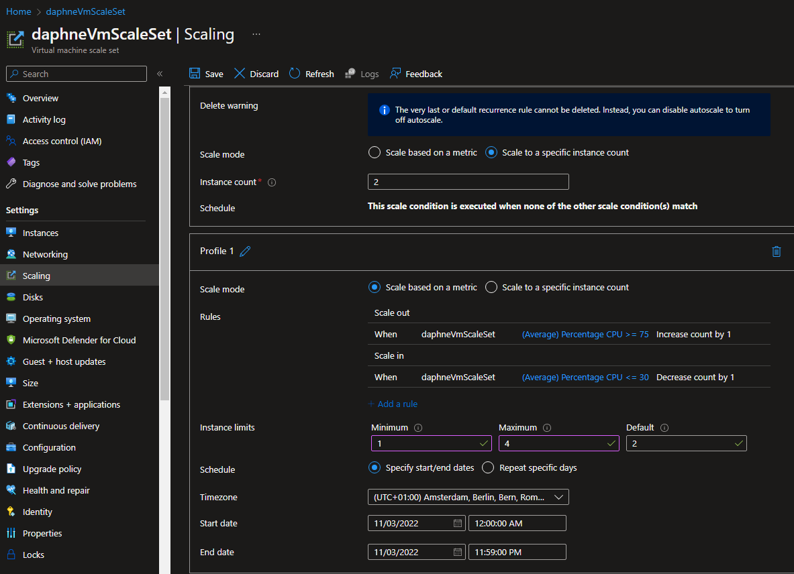
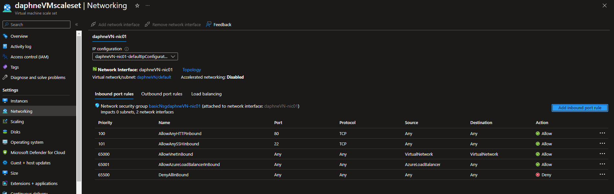
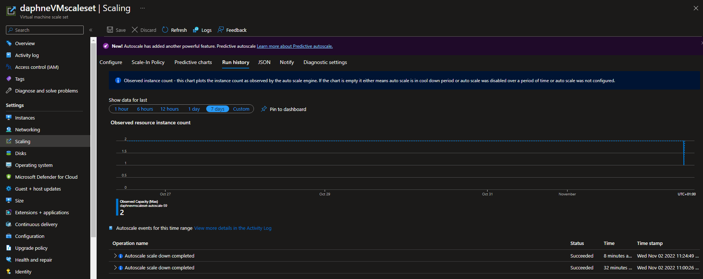
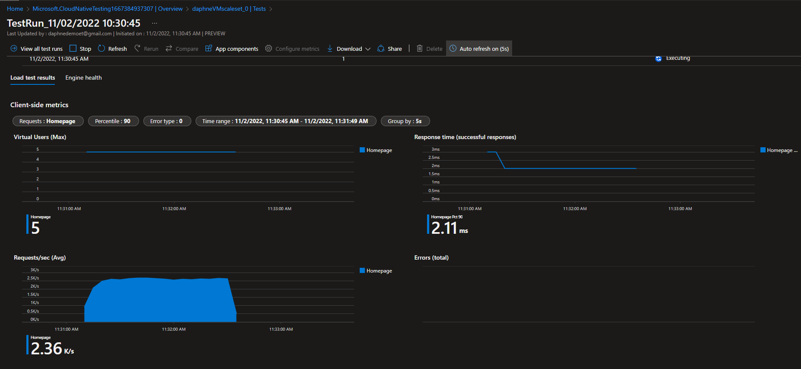

# [ Azure Load Balancer (ALB), Autoscaling ]
Learning more about autoscaling while working with a VM.

## Key terminology
- ALB:\
With Azure Load Balancer, you can scale your applications and create highly available services. Load balancer supports both inbound and outbound scenarios. Load balancer provides low latency and high throughput, and scales up to millions of flows for all TCP and UDP applications.
- VM scale set:\
Azure virtual machine scale sets let you create and manage a group of load balanced VMs. The number of VM instances can automatically increase or decrease in response to demand or a defined schedule. Scale sets provide the following key benefits: Easy to create and manage multiple VMs.

#
## Exercise 1
- Maak een Virtual Machine Scale Set met de volgende vereisten:\
Ubuntu Server 20.04 LTS - Gen1\
Size: Standard_B1ls\
Allowed inbound ports:\
SSH (22)\
HTTP (80)\
OS Disk type: Standard SSD\
Networking: defaults\
Boot diagnostics zijn niet nodig\
Custom data:\
#!/bin/bash\
sudo su\
apt update\
apt install apache2 -y\
ufw allow 'Apache'\
systemctl enable apache2\
systemctl restart apache2\
Initial Instance Count: 2\
Scaling Policy: Custom\
Aantal VMs: minimaal 1 en maximaal 4\
Voeg een VM toe bij 75% CPU gebruik\
Verwijder een VM bij 30% CPU gebruik
## Exercise 2
- Controleer of je via het endpoint van je load balancer bij de webserver kan komen.
- Voer een load test uit op je server(s) om auto scaling the activeren. Er kan een delay zitten in het creëren van nieuwe VMs, afhankelijk van de settings in je VM Scale Set.

#
### Sources
- 
- 

#
### Overcome challenges
I didn't knew enough about autoscaling yet so I did research about it. 
#

## Results 

