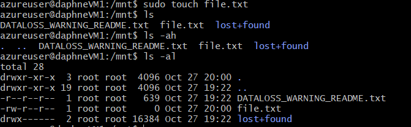
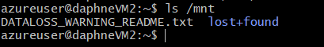
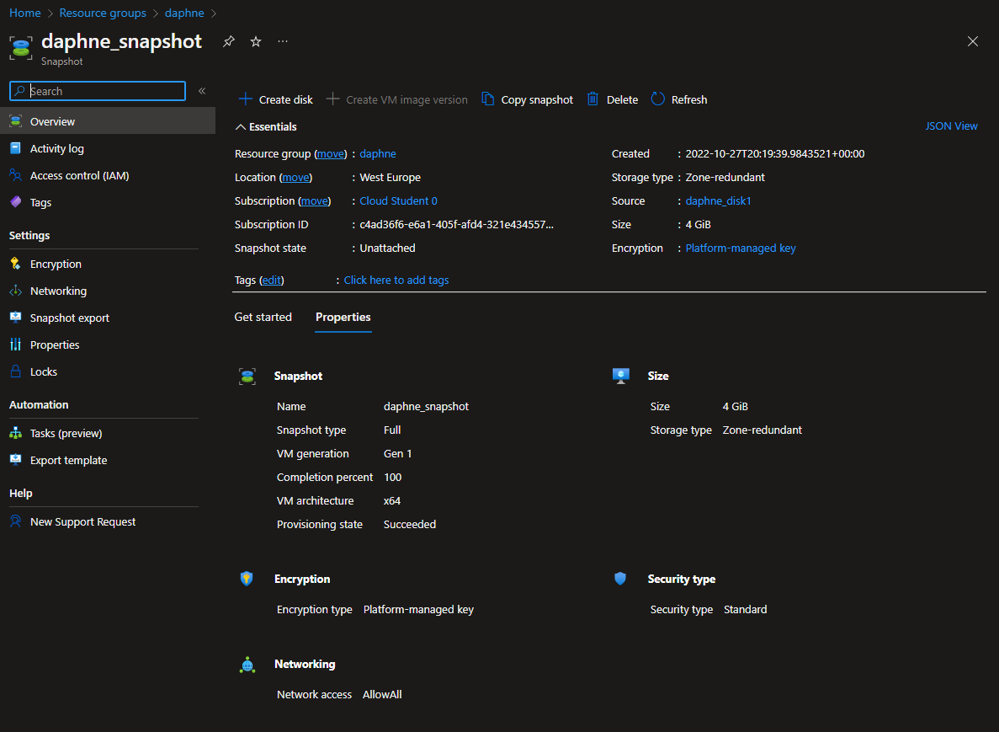
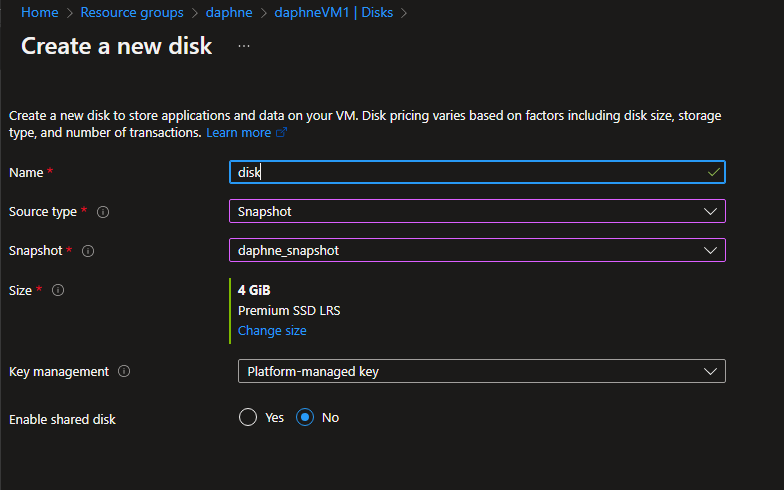

# [ Disk Storage ]
Learning more about VMs and Azure Disk storage.

## Key terminology
- Managed Disks:\
Azure managed disks are block-level storage volumes that are managed by Azure and used with Azure Virtual Machines. Managed disks are like a physical disk in an on-premises server but, virtualized.
- Unmanaged Disks:\
Unmanaged disk consists of three data services: Blob storage, File storage, and Queue storage. In an unmanaged disk, you manage the storage accounts that you use to store the virtual hard disk (VHD) files that correspond to your VM disks.
- Shared disk:\
Azure shared disks are the ability to connect managed disks to multiple VMs at the same time. Managed disks with shared disks enabled provide shared block storage that can be accessed by multiple VMs.

#
## Exercise
- Start 2 Linux VMs. Zorgt dat je voor beide toegang hebt via SSH
- Maak een Azure Managed Disk aan en koppel deze aan beide VMs tegelijk.
- Creëer op je eerste machine een bestand en plaats deze op de Shared Disk.
- Kijk op de tweede machine of je het bestand kan lezen.
- Maak een snapshot van de schijf en probeer hier een nieuwe Disk mee te maken
- Mount deze nieuwe Disk en bekijk het bestand. 

#
### Sources
- https://docs.microsoft.com/en-us/azure/virtual-machines/disks-types
- https://learn.microsoft.com/en-us/azure/virtual-machines/windows/quick-create-portal
- https://learn.microsoft.com/en-us/azure/virtual-machines/windows/attach-managed-disk-portal
- https://learn.microsoft.com/en-us/azure/virtual-machines/disks-shared-enable?tabs=azure-portal

#
### Overcome challenges
I didn't knew enough about the shared disks yet so I did research to understand them better. 
#

## Results 

\
First VM
#

\
There is no file on the second VM
\
#
\
Snap shot

Mounted
