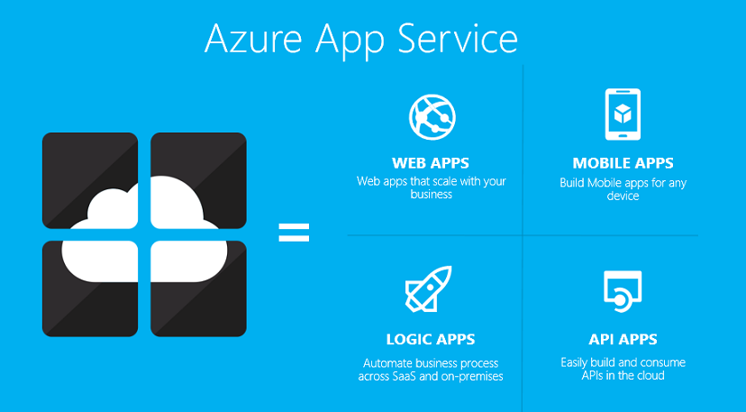
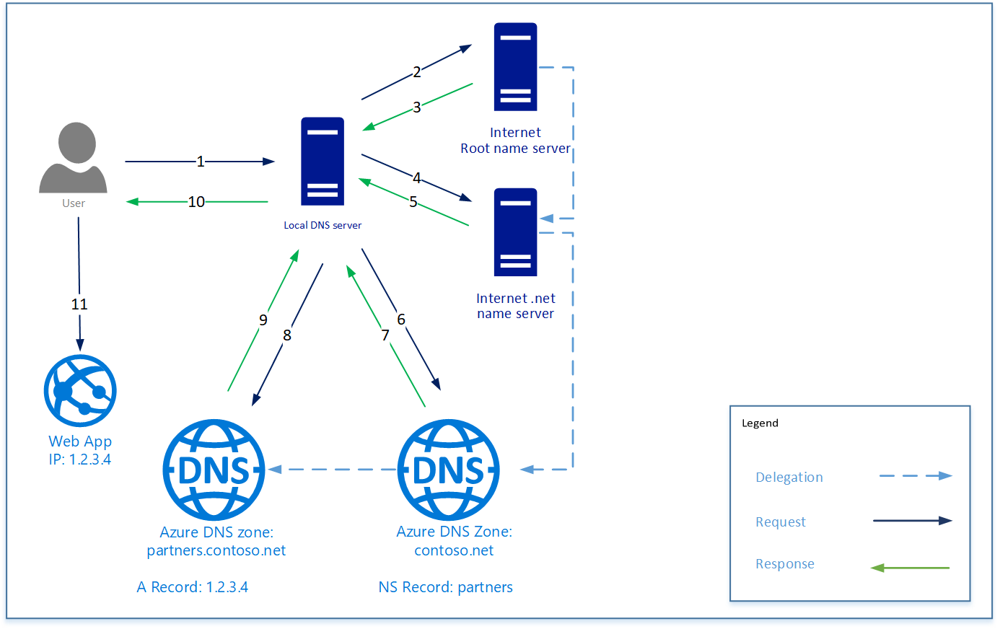
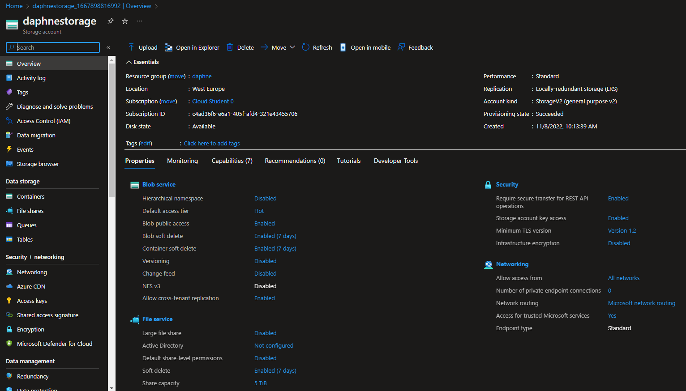
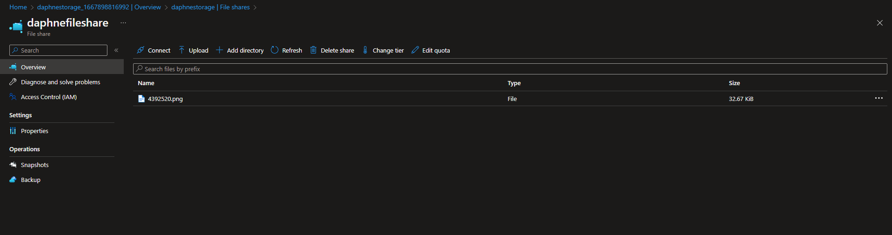
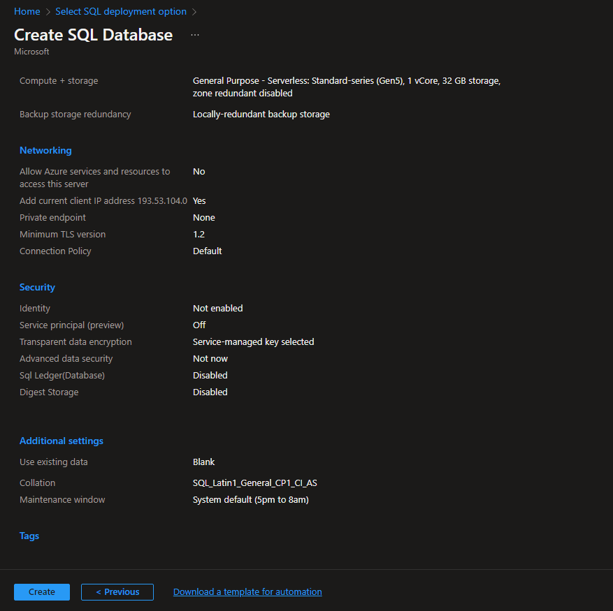
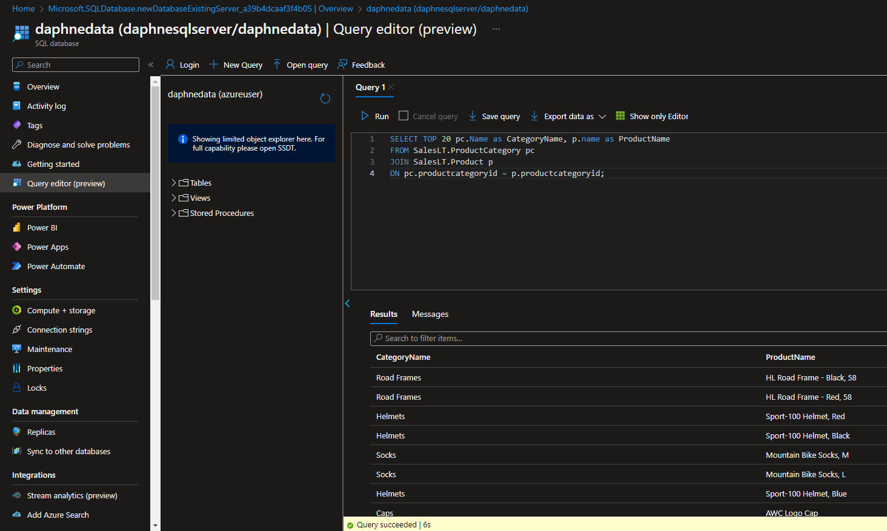
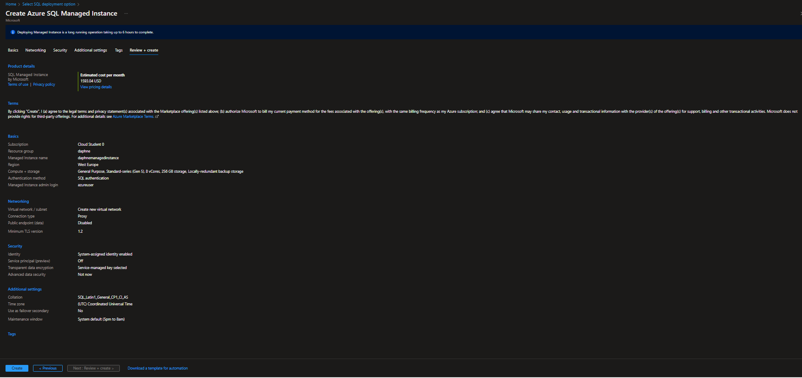

# [ Database ]
Learning about Azure App Service, Content Delivery, Azure DNS, Azure Files and Database + managed instance.

#
## Exercise
Study:
- App Service
- Content Delivery Network (CDN) 
- Azure DNS 

Exercise:
- Azure Files
- Azure Database (+ managed instance)

#
### Sources
Study:
- https://learn.microsoft.com/en-us/azure/app-service/overview
- https://learn.microsoft.com/en-us/azure/cdn/cdn-overview
- https://learn.microsoft.com/en-us/azure/dns/dns-overview
- https://www.youtube.com/watch?v=nyH0nYhMW9M

Exercise:
- https://learn.microsoft.com/en-us/azure/storage/files/storage-how-to-use-files-portal?tabs=azure-portal
- https://learn.microsoft.com/en-us/azure/azure-sql/database/single-database-create-quickstart?view=azuresql&tabs=azure-portal
- https://learn.microsoft.com/en-us/azure/azure-sql/managed-instance/instance-create-quickstart?view=azuresql

#
### Overcome challenges
The query didn't work at first, I found out that it was because I didn't set the existing data to 'sample'.
#

## Results 

### App service

Azure App Service is the fastest and easiest way to host web applications and APIs in Azure. Azure App Service provides a fully managed, platform as a service hosting solution that supports a variety of languages like .NET, .NET Core, Java, Ruby, Node.js, PHP, and Python. Hosting options are available on both Windows and Linux depending on the application runtime.

Azure App Service patches and maintains the OS and language frameworks automatically for you, they also support autoscaling, high availability and deployment slots so you don’t have to worry about the infrastructure and can fully focus on building your app.

Azure App Service is an HTTP-based service for hosting web applications, REST APIs, and mobile back ends.

App service can provide your application with security, load balancing, autoscaling, and automated management. You can also take advantage of its DevOps capabilities, such as continuous deployment from Azure DevOps, GitHub, Docker Hub, and other sources, package management, staging environments, custom domain, and TLS/SSL certificates.

### Content Delivery Network (CDN)
A CDN is a network of servers that deliver web content to users. CDNs store caches content on edge servers i point-of-presence (POP) locations that are close to end users to minimize latency.\

Benefits of using Azure CDN to deliver web site assets include:
- Better performance and good user experience for end users, especially when using applications which multiple round-trips are required to load content.\
(Round-trip apps are apps that change pages on every get/post/put request).
- Large scaling to better handle high loads such as the start of a product launch event.
- Distribution of user requests and serving of content from edge servers so that less traffic is sent to the origin server.

An origin server (origin) is a computer or service where content is stored or computed and is designed to listen and respond to incoming requests.

Edge servers are powerful computers put at the network edge where data computation needs to happen.

### Azure DNS
Azure DNS is a hosting service for DNS domain that provide name resolutions by using Azure infrastructure. You can manage your DNS records by using teh same credentials, APIs, tools and billing as your other Azure services.

You can't use Azure DNS to buy a domain name. You can buy a domain name by using App Service Domains or a third-party domain name registrar. 

DNS domains in Azure DNS are hosted on Azure's global network of DNS name servers. Azure DNS uses anycast networking. Each DNS request is answered by the closest available DNS server for fast performance and high availability.

#
## Exercise Azure Files
Azure Files offers fully managed file shares in the cloud that are accessible via the industry standard Server Message Block (SMB) protocol, Network File System (NFS) protocol, and Azure Files REST API. Azure file shares can be mounted concurrently by cloud or on-premises deployments. SMB Azure file shares are accessible from Windows, Linux, and macOS clients.

#
## Exercise Azure SQL Database

Azure SQL Database is a fully managed platform as a service (PaaS) database engine that handles most of the database management functions such as upgrading, patching, backups, and monitoring without user involvement.

#

## Managed instance

Azure SQL Managed Instance is the intelligent, scalable cloud database service that combines the broadest SQL Server database engine compatibility with all the benefits of a fully managed and evergreen platform as a service.

